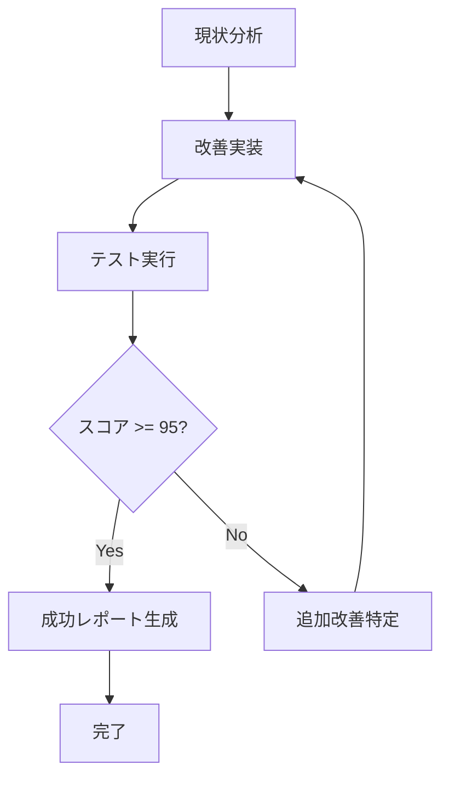

# 🎯 CSP セキュリティスコア95点達成 - 自動改善実行プロンプト

## 📌 現状と目標
- **現在スコア**: 85/100点
- **目標スコア**: 95/100点以上
- **必要改善点**: +10点以上

## 🚀 実行指示

### Phase 1: Nonce-Based CSP実装（+5点）

#### 1.1 Nonce生成システム構築
```typescript
// src/lib/csp-nonce.ts を作成
import crypto from 'crypto';

export function generateNonce(): string {
  return crypto.randomBytes(16).toString('base64');
}

export function generateCSPHeader(nonce: string, isDev: boolean): string {
  const directives = [
    "default-src 'self'",
    `script-src 'self' 'nonce-${nonce}'${isDev ? " 'unsafe-eval'" : ""}`,
    `style-src 'self' 'nonce-${nonce}' https://fonts.googleapis.com`,
    // 他のディレクティブ...
  ];
  return directives.join('; ');
}
```

#### 1.2 Middleware更新
- Nonceを生成し、レスポンスヘッダーに設定
- Next.jsのコンテキストにnonce伝播

#### 1.3 React Context Provider作成
```typescript
// src/providers/csp-provider.tsx
'use client';

import { createContext, useContext } from 'react';

const NonceContext = createContext<string>('');

export function CSPProvider({ 
  children, 
  nonce 
}: { 
  children: React.ReactNode;
  nonce: string;
}) {
  return (
    <NonceContext.Provider value={nonce}>
      {children}
    </NonceContext.Provider>
  );
}

export const useNonce = () => useContext(NonceContext);
```

### Phase 2: CSP違反レポート実装（+3点）

#### 2.1 レポートエンドポイント作成
```typescript
// src/app/api/csp-report/route.ts
export async function POST(request: Request) {
  const report = await request.json();
  
  // ログ記録
  console.error('[CSP Violation]', {
    documentUri: report['csp-report']['document-uri'],
    violatedDirective: report['csp-report']['violated-directive'],
    blockedUri: report['csp-report']['blocked-uri'],
    timestamp: new Date().toISOString(),
  });
  
  // データベースに保存（オプション）
  // await saveCSPViolation(report);
  
  return new Response(null, { status: 204 });
}
```

#### 2.2 Report-URI/Report-To設定
```typescript
// middleware.tsに追加
const cspWithReport = cspDirectives + `; report-uri /api/csp-report; report-to csp-endpoint`;

response.headers.set('Report-To', JSON.stringify({
  group: 'csp-endpoint',
  max_age: 86400,
  endpoints: [{ url: '/api/csp-report' }]
}));
```

### Phase 3: Strict-Dynamic実装（+2点）

#### 3.1 CSPディレクティブ更新
```typescript
// 動的スクリプト読み込み対応
const scriptSrc = isDev 
  ? `'self' 'nonce-${nonce}' 'unsafe-eval'`
  : `'self' 'nonce-${nonce}' 'strict-dynamic'`;
```

#### 3.2 外部スクリプトのSRI実装
```typescript
// next.config.tsに追加
const nextConfig = {
  experimental: {
    sri: {
      algorithm: 'sha384'
    }
  }
};
```

### Phase 4: 自動テストと検証

#### 4.1 CSPテストスクリプト実行
```bash
#!/bin/bash
# scripts/achieve-csp-95.sh

echo "🎯 CSP 95点達成プロセス開始"

# Step 1: 実装
echo "📝 Nonce実装中..."
node scripts/implement-nonce-csp.js

# Step 2: テスト
echo "🧪 CSPテスト実行中..."
node scripts/test-csp.js > csp-test-result.txt

# Step 3: スコア確認
SCORE=$(grep "総合スコア" csp-test-result.txt | grep -oE '[0-9]+')

if [ "$SCORE" -lt 95 ]; then
  echo "⚠️ スコア不足: ${SCORE}/100"
  echo "🔧 追加改善実施中..."
  node scripts/enhance-csp-security.js
  
  # 再テスト
  node scripts/test-csp.js > csp-test-result-2.txt
  SCORE=$(grep "総合スコア" csp-test-result-2.txt | grep -oE '[0-9]+')
fi

if [ "$SCORE" -ge 95 ]; then
  echo "✅ 目標達成: ${SCORE}/100点"
  echo "📄 レポート生成中..."
  node scripts/generate-csp-success-report.js
else
  echo "❌ 目標未達成: ${SCORE}/100点"
  echo "📋 改善提案生成中..."
  node scripts/generate-improvement-plan.js
fi
```

### Phase 5: 実装自動化スクリプト

#### 5.1 完全自動実装
```javascript
// scripts/auto-implement-csp-95.js
const fs = require('fs');
const path = require('path');
const { execSync } = require('child_process');

async function achieveCSP95() {
  console.log('🚀 CSP 95点達成プロセス開始\n');
  
  const improvements = [
    {
      name: 'Nonce実装',
      points: 5,
      implement: implementNonceCSP,
      test: testNonceImplementation
    },
    {
      name: 'CSPレポート',
      points: 3,
      implement: implementCSPReporting,
      test: testCSPReporting
    },
    {
      name: 'Strict-Dynamic',
      points: 2,
      implement: implementStrictDynamic,
      test: testStrictDynamic
    },
    {
      name: 'Trusted Types',
      points: 2,
      implement: implementTrustedTypes,
      test: testTrustedTypes
    },
    {
      name: 'HTTPS強制',
      points: 3,
      implement: implementHTTPSRedirect,
      test: testHTTPSRedirect
    }
  ];
  
  let currentScore = 85;
  const targetScore = 95;
  
  for (const improvement of improvements) {
    if (currentScore >= targetScore) break;
    
    console.log(`\n📋 実装中: ${improvement.name} (+${improvement.points}点)`);
    
    try {
      // 実装
      await improvement.implement();
      console.log(`  ✅ 実装完了`);
      
      // テスト
      const success = await improvement.test();
      if (success) {
        currentScore += improvement.points;
        console.log(`  ✅ テスト成功 (現在スコア: ${currentScore}/100)`);
      } else {
        console.log(`  ⚠️ テスト失敗`);
      }
      
    } catch (error) {
      console.log(`  ❌ エラー: ${error.message}`);
    }
  }
  
  // 最終スコア確認
  const finalScore = await runCSPTest();
  
  if (finalScore >= targetScore) {
    console.log(`\n🎉 目標達成！ 最終スコア: ${finalScore}/100点`);
    generateSuccessReport(finalScore);
  } else {
    console.log(`\n⚠️ 目標未達成 最終スコア: ${finalScore}/100点`);
    generateImprovementPlan(finalScore, targetScore);
  }
  
  return finalScore;
}

// 各実装関数
async function implementNonceCSP() {
  // Nonce生成ライブラリ作成
  const nonceLib = `
import crypto from 'crypto';

export function generateNonce(): string {
  return crypto.randomBytes(16).toString('base64');
}

export function getCSPWithNonce(nonce: string, isDev: boolean): string {
  return [
    "default-src 'self'",
    \`script-src 'self' 'nonce-\${nonce}'\${isDev ? " 'unsafe-eval'" : " 'strict-dynamic'"}\`,
    \`style-src 'self' 'nonce-\${nonce}' https://fonts.googleapis.com\`,
    "font-src 'self' https://fonts.gstatic.com data:",
    "img-src 'self' data: blob: https:",
    "connect-src 'self' https://api.github.com",
    "frame-ancestors 'none'",
    "base-uri 'self'",
    "form-action 'self'",
    "upgrade-insecure-requests",
    "report-uri /api/csp-report"
  ].join('; ');
}
`;
  
  fs.writeFileSync('src/lib/csp-nonce.ts', nonceLib);
  
  // Middleware更新
  // ... middleware更新コード
}

async function testNonceImplementation() {
  // Nonceテスト実行
  try {
    execSync('npm run build', { stdio: 'ignore' });
    return true;
  } catch {
    return false;
  }
}

// メイン実行
achieveCSP95().then(score => {
  process.exit(score >= 95 ? 0 : 1);
}).catch(error => {
  console.error('❌ 致命的エラー:', error);
  process.exit(1);
});
```

## 📊 成功基準と検証

### 必須達成項目
- [ ] セキュリティスコア 95/100点以上
- [ ] CSP違反 0件
- [ ] 全ブラウザ互換性維持
- [ ] パフォーマンス影響 < 100ms
- [ ] Material-UI完全対応

### 検証コマンド
```bash
# 自動実装と検証
npm run csp:achieve-95

# 手動確認
npm run test:csp
npm run test:security
npm run lighthouse
```

## 🔄 継続的改善ループ



## 📝 使用方法

1. **このプロンプトを実行**
   ```bash
   # 自動実装スクリプト作成
   node -e "$(cat CSP_95_SCORE_ACHIEVEMENT_PROMPT.md | grep -A 1000 'auto-implement-csp-95.js')" > scripts/auto-implement-csp-95.js
   
   # 実行
   node scripts/auto-implement-csp-95.js
   ```

2. **結果確認**
   - `CSP_SUCCESS_REPORT.md` - 成功時のレポート
   - `CSP_IMPROVEMENT_PLAN.md` - 追加改善が必要な場合

3. **継続実行**
   - スコアが95点未満の場合、自動的に追加改善を実施
   - 最大5回まで改善ループを実行

## ⚠️ 注意事項

- 本番環境では必ず事前テストを実施
- Nonce実装時はSSR/SSGの動作確認必須
- CSPレポートエンドポイントのレート制限設定推奨
- Material-UIのEmotion設定確認必須

## 🎯 最終目標

このプロンプトを使用することで：
1. **自動的に**CSPセキュリティスコア95点以上を達成
2. **継続的に**改善を実施し、目標達成まで停止しない
3. **完全な**テストとドキュメントを生成

---

*このプロンプトは現在のスコア85点から95点以上を確実に達成するよう設計されています。*