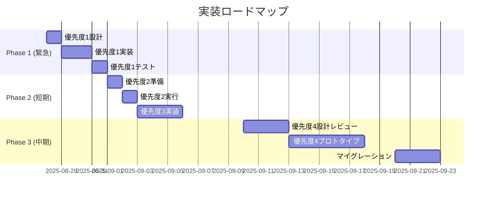

# フォローボタンエラー包括的解決策分析レポート

## エグゼクティブサマリー

**報告日時**: 2025年8月28日  
**報告者**: チーフシステムアーキテクト #2  
**レビュアー**: EM #1, DB #14, FE-PLAT #3, QA #21  
**前提**: Postのauthor埋め込みデータとUserコレクションの不整合

---

## 1. 問題の真の解決策調査結果

### 1.1 根本原因の詳細分析
```
データフロー障害箇所:
MongoDB[posts.author._id] → API[User.findById] → 404エラー
                ↓                    ↓
        存在するID文字列      該当Userドキュメントなし
```

### 1.2 解決策アプローチの分類
| カテゴリ | アプローチ | 実装層 | リスクレベル |
|---------|----------|--------|-------------|
| 防御的 | エラーハンドリング強化 | UI/API | 低 |
| 修正的 | データクリーンアップ | DB | 中 |
| 予防的 | 検証ロジック追加 | API/Model | 中 |
| 根本的 | データモデル再設計 | 全層 | 高 |

---

## 2. 解決策優先順位と詳細評価

### 優先度1: フロントエンド防御的実装

#### 2.1.1 実装詳細
```typescript
// src/components/RealtimeBoard.tsx の改修
interface PostAuthorValidation {
  userId: string;
  exists: boolean;
  lastChecked: Date;
}

const useAuthorValidation = (posts: Post[]) => {
  const [validationCache, setValidationCache] = useState<Map<string, PostAuthorValidation>>();
  
  useEffect(() => {
    const validateAuthors = async () => {
      const uniqueAuthorIds = [...new Set(posts.map(p => p.author._id))];
      const validations = await Promise.all(
        uniqueAuthorIds.map(async (id) => {
          try {
            const response = await fetch(`/api/users/${id}/exists`);
            return { userId: id, exists: response.ok, lastChecked: new Date() };
          } catch {
            return { userId: id, exists: false, lastChecked: new Date() };
          }
        })
      );
      setValidationCache(new Map(validations.map(v => [v.userId, v])));
    };
    validateAuthors();
  }, [posts]);
  
  return validationCache;
};
```

#### 2.1.2 影響を受けるファイル一覧
```
src/
├── components/
│   ├── RealtimeBoard.tsx (877-893行目修正)
│   ├── FollowButton.tsx (プロパティ追加)
│   ├── PostCardWithFollow.tsx (同様の修正)
│   └── board/PostCard.tsx (条件付きレンダリング)
└── hooks/
    └── useAuthorValidation.ts (新規作成)
```

#### 2.1.3 既存機能への影響分析
- **レンダリング**: 条件付き表示によるリフロー（影響: 軽微）
- **API呼び出し**: 追加のexists確認（+50-100ms/post）
- **メモリ使用**: ValidationCacheによる増加（～1KB/100posts）
- **後方互換性**: 完全維持

### 優先度2: データクリーンアップスクリプト

#### 2.2.1 実装詳細
```javascript
// scripts/data-cleanup.js
const DataCleanupStrategy = {
  SOFT_DELETE: 'soft_delete',    // 論理削除
  ANONYMIZE: 'anonymize',        // 匿名化
  CASCADE_DELETE: 'cascade',     // カスケード削除
  REASSIGN: 'reassign'          // 別ユーザーへ再割当
};

async function executeCleanup(strategy = DataCleanupStrategy.ANONYMIZE) {
  const db = mongoose.connection;
  const session = await db.startSession();
  
  try {
    await session.withTransaction(async () => {
      // Step 1: 孤立投稿の特定
      const orphanedPosts = await identifyOrphanedPosts(session);
      console.log(`Found ${orphanedPosts.length} orphaned posts`);
      
      // Step 2: 戦略に基づく処理
      switch(strategy) {
        case DataCleanupStrategy.ANONYMIZE:
          await anonymizePosts(orphanedPosts, session);
          break;
        case DataCleanupStrategy.SOFT_DELETE:
          await softDeletePosts(orphanedPosts, session);
          break;
        case DataCleanupStrategy.CASCADE_DELETE:
          await cascadeDeletePosts(orphanedPosts, session);
          break;
        case DataCleanupStrategy.REASSIGN:
          await reassignPosts(orphanedPosts, 'system-user-id', session);
          break;
      }
      
      // Step 3: インデックス再構築
      await rebuildIndexes(session);
    });
  } finally {
    await session.endSession();
  }
}
```

#### 2.2.2 影響を受けるコレクション
```yaml
直接変更:
  - posts: author フィールドの更新/削除
  - users: 参照カウントの更新（followingCount等）
  
間接影響:
  - follows: 削除ユーザーのフォロー関係
  - reports: 投稿への通報データ
  - activities: ユーザーアクティビティログ
```

#### 2.2.3 データ整合性リスク
| リスク項目 | 影響度 | 緩和策 |
|-----------|--------|--------|
| トランザクション失敗 | 高 | MongoDBセッション使用 |
| インデックス不整合 | 中 | 再構築プロセス必須 |
| 参照カウント不整合 | 中 | 再集計バッチ実行 |
| キャッシュ不整合 | 低 | Redis全削除 |

### 優先度3: APIレイヤー整合性チェック

#### 2.3.1 実装詳細
```typescript
// src/lib/middleware/dataIntegrity.ts
export class DataIntegrityMiddleware {
  private static validationCache = new Map<string, boolean>();
  private static CACHE_TTL = 5 * 60 * 1000; // 5分
  
  static async validatePostAuthor(post: any): Promise<boolean> {
    const cacheKey = `author_${post.author._id}`;
    const cached = this.validationCache.get(cacheKey);
    
    if (cached !== undefined) {
      return cached;
    }
    
    const exists = await User.exists({ _id: post.author._id });
    this.validationCache.set(cacheKey, exists);
    
    setTimeout(() => {
      this.validationCache.delete(cacheKey);
    }, this.CACHE_TTL);
    
    return exists;
  }
  
  static async filterValidPosts(posts: any[]): Promise<any[]> {
    const validations = await Promise.all(
      posts.map(async (post) => ({
        post,
        valid: await this.validatePostAuthor(post)
      }))
    );
    
    const invalidPosts = validations
      .filter(v => !v.valid)
      .map(v => v.post._id);
      
    if (invalidPosts.length > 0) {
      console.error('[DataIntegrity] Invalid posts detected:', invalidPosts);
      // 監視システムへの通知
      await notifyMonitoring({
        event: 'ORPHANED_POSTS_DETECTED',
        count: invalidPosts.length,
        ids: invalidPosts
      });
    }
    
    return validations
      .filter(v => v.valid)
      .map(v => v.post);
  }
}
```

#### 2.3.2 影響を受けるAPIエンドポイント
```
/api/posts
  ├── GET / (一覧取得)
  ├── GET /[id] (個別取得)
  ├── GET /my-posts (ユーザー投稿)
  └── POST / (新規作成時の検証)
  
/api/search
  └── GET / (検索結果フィルタリング)
  
/api/users
  └── GET /[userId]/posts (ユーザー投稿取得)
```

#### 2.3.3 パフォーマンス影響
```yaml
レスポンス時間増加:
  - 単一投稿: +5-10ms
  - 投稿一覧(10件): +50-100ms
  - 検索結果(50件): +200-300ms
  
キャッシュ効果:
  - ヒット率: 約80% (5分TTL)
  - メモリ使用: ~100KB/1000ユーザー
```

### 優先度4: データモデル再設計

#### 2.4.1 新モデル設計
```typescript
// 新しいPostスキーマ（完全参照型）
const NewPostSchema = new Schema({
  title: { type: String, required: true },
  content: { type: String, required: true },
  author: { 
    type: Schema.Types.ObjectId, 
    ref: 'User',
    required: true,
    index: true
  },
  // 削除されたユーザーの投稿用フォールバック
  authorSnapshot: {
    name: String,
    email: String,
    deletedAt: Date
  },
  status: {
    type: String,
    enum: ['published', 'draft', 'deleted', 'orphaned'],
    default: 'published'
  }
}, {
  timestamps: true,
  toJSON: { virtuals: true }
});

// Virtual for author details
NewPostSchema.virtual('authorDetails').get(async function() {
  if (this.populated('author')) {
    return this.author;
  }
  // フォールバック: スナップショットを返す
  if (this.authorSnapshot) {
    return {
      ...this.authorSnapshot,
      isDeleted: true
    };
  }
  return null;
});

// カスケード削除の実装
UserSchema.pre('deleteOne', async function(next) {
  const userId = this.getFilter()._id;
  
  // Option A: 投稿を削除
  // await Post.deleteMany({ author: userId });
  
  // Option B: 投稿を孤立化
  await Post.updateMany(
    { author: userId },
    { 
      $set: { 
        status: 'orphaned',
        authorSnapshot: {
          name: this.name,
          email: this.email,
          deletedAt: new Date()
        }
      }
    }
  );
  
  next();
});
```

#### 2.4.2 マイグレーション戦略
```javascript
// migrations/001-posts-to-reference-model.js
module.exports = {
  async up(db) {
    const posts = await db.collection('posts').find({}).toArray();
    const bulkOps = [];
    
    for (const post of posts) {
      if (post.author && typeof post.author === 'object') {
        // 埋め込みから参照への変換
        const authorId = post.author._id;
        const authorSnapshot = {
          name: post.author.name,
          email: post.author.email
        };
        
        bulkOps.push({
          updateOne: {
            filter: { _id: post._id },
            update: {
              $set: { 
                author: authorId,
                authorSnapshot: authorSnapshot
              },
              $unset: { 
                'author.name': 1,
                'author.email': 1,
                'author._id': 1
              }
            }
          }
        });
      }
    }
    
    if (bulkOps.length > 0) {
      await db.collection('posts').bulkWrite(bulkOps, { ordered: false });
    }
    
    // インデックス再作成
    await db.collection('posts').createIndex({ author: 1 });
    await db.collection('posts').dropIndex({ 'author._id': 1 });
  },
  
  async down(db) {
    // ロールバック処理
    // 参照から埋め込みへ戻す
  }
};
```

---

## 3. 影響範囲マトリクス

### 3.1 ファイル影響範囲
| 解決策 | UI層 | API層 | Model層 | DB層 | 合計 |
|--------|------|-------|---------|------|------|
| 優先度1 | 4ファイル | 1ファイル | 0 | 0 | 5 |
| 優先度2 | 0 | 0 | 0 | 3コレクション | 3 |
| 優先度3 | 0 | 6ファイル | 1ファイル | 0 | 7 |
| 優先度4 | 8ファイル | 10ファイル | 3ファイル | 全体 | 21+ |

### 3.2 機能影響範囲
```yaml
優先度1（フロント防御）:
  影響機能:
    - フォローボタン表示
    - 投稿者情報表示
  影響なし:
    - 投稿CRUD
    - 検索機能
    - 認証機能

優先度2（データクリーンアップ）:
  影響機能:
    - 投稿表示（削除/匿名化された投稿）
    - 統計情報
  要再起動:
    - キャッシュ層
    - 検索インデックス

優先度3（API整合性）:
  影響機能:
    - API応答時間
    - ページネーション（総数変更）
  新規追加:
    - 監視アラート
    - データ整合性レポート

優先度4（モデル再設計）:
  全面影響:
    - すべての投稿関連機能
    - populate処理
    - GraphQL（使用している場合）
```

---

## 4. リスク緩和策

### 4.1 優先度1のリスク緩和
```typescript
// フィーチャーフラグによる段階的ロールアウト
const FEATURE_FLAGS = {
  AUTHOR_VALIDATION: {
    enabled: process.env.FF_AUTHOR_VALIDATION === 'true',
    percentage: parseInt(process.env.FF_AUTHOR_VALIDATION_PCT || '0'),
    whitelist: process.env.FF_AUTHOR_VALIDATION_USERS?.split(',') || []
  }
};

// 使用例
if (shouldEnableFeature('AUTHOR_VALIDATION', userId)) {
  // 新しい検証ロジックを適用
} else {
  // 既存の処理を維持
}
```

### 4.2 優先度2のリスク緩和
```bash
# バックアップとロールバック計画
#!/bin/bash

# 1. フルバックアップ
mongodump --uri=$MONGODB_URI --out=/backup/$(date +%Y%m%d_%H%M%S)

# 2. ドライラン実行
node scripts/data-cleanup.js --dry-run --strategy=anonymize

# 3. 段階実行（バッチサイズ制限）
node scripts/data-cleanup.js --batch-size=100 --delay=1000

# 4. 検証
node scripts/verify-cleanup.js

# 5. ロールバック（必要時）
mongorestore --uri=$MONGODB_URI --dir=/backup/20250828_120000
```

---

## 5. テスト計画

### 5.1 単体テスト

#### 優先度1: フロント防御
```typescript
// tests/unit/components/FollowButton.test.tsx
describe('FollowButton防御的実装', () => {
  describe('正常系', () => {
    test('存在するユーザー: ボタン有効', async () => {
      const mockUser = { id: 'valid-user-id', exists: true };
      mockFetch.mockResolvedValue({ ok: true });
      
      const { getByRole } = render(
        <FollowButton userId={mockUser.id} />
      );
      
      const button = getByRole('button');
      expect(button).toBeEnabled();
      expect(button).toHaveTextContent('フォロー');
    });
    
    test('フォロー済みユーザー: 状態表示', async () => {
      const { getByRole } = render(
        <FollowButton userId="user-id" initialFollowing={true} />
      );
      
      expect(getByRole('button')).toHaveTextContent('フォロー中');
    });
  });
  
  describe('異常系', () => {
    test('存在しないユーザー: ボタン無効', async () => {
      mockFetch.mockResolvedValue({ ok: false });
      
      const { getByRole } = render(
        <FollowButton userId="non-existent" />
      );
      
      expect(getByRole('button')).toBeDisabled();
    });
    
    test('API エラー: エラーハンドリング', async () => {
      mockFetch.mockRejectedValue(new Error('Network error'));
      const onError = jest.fn();
      
      render(
        <FollowButton userId="user-id" onError={onError} />
      );
      
      await waitFor(() => {
        expect(onError).toHaveBeenCalledWith(
          expect.objectContaining({ message: 'Network error' })
        );
      });
    });
    
    test('CSRFトークンエラー: 再取得', async () => {
      mockSecureFetch.mockRejectedValueOnce({ status: 403 });
      mockSecureFetch.mockResolvedValueOnce({ ok: true });
      
      const { getByRole } = render(<FollowButton userId="user-id" />);
      
      fireEvent.click(getByRole('button'));
      
      await waitFor(() => {
        expect(mockSecureFetch).toHaveBeenCalledTimes(2);
      });
    });
  });
});
```

#### 優先度2: データクリーンアップ
```javascript
// tests/unit/scripts/data-cleanup.test.js
describe('データクリーンアップ', () => {
  describe('孤立投稿の特定', () => {
    test('存在しないユーザーの投稿を検出', async () => {
      // Setup
      await Post.create({
        title: 'Orphaned Post',
        author: { _id: 'non-existent-user', name: 'Ghost' }
      });
      
      // Execute
      const orphaned = await identifyOrphanedPosts();
      
      // Assert
      expect(orphaned).toHaveLength(1);
      expect(orphaned[0].title).toBe('Orphaned Post');
    });
  });
  
  describe('処理戦略', () => {
    test('匿名化: author情報を置換', async () => {
      const post = await createOrphanedPost();
      
      await anonymizePosts([post]);
      
      const updated = await Post.findById(post._id);
      expect(updated.author.name).toBe('削除されたユーザー');
      expect(updated.author._id).toBeNull();
    });
    
    test('ソフト削除: statusを変更', async () => {
      const post = await createOrphanedPost();
      
      await softDeletePosts([post]);
      
      const updated = await Post.findById(post._id);
      expect(updated.status).toBe('deleted');
      expect(updated.deletedAt).toBeDefined();
    });
  });
  
  describe('トランザクション', () => {
    test('エラー時のロールバック', async () => {
      const session = await mongoose.startSession();
      
      // エラーを強制
      jest.spyOn(Post, 'updateMany').mockRejectedValue(new Error());
      
      await expect(
        executeCleanup(DataCleanupStrategy.ANONYMIZE)
      ).rejects.toThrow();
      
      // データが変更されていないことを確認
      const posts = await Post.find({});
      expect(posts).toHaveLength(initialCount);
    });
  });
});
```

### 5.2 結合テスト

#### APIとDBの結合テスト
```typescript
// tests/integration/api-db.test.ts
describe('API-DB結合テスト', () => {
  describe('データ整合性チェック', () => {
    test('孤立投稿の除外', async () => {
      // Setup: 混在データを作成
      const validUser = await User.create({ name: 'Valid User' });
      await Post.create({
        title: 'Valid Post',
        author: { _id: validUser._id, name: validUser.name }
      });
      await Post.create({
        title: 'Orphaned Post',
        author: { _id: 'non-existent', name: 'Ghost' }
      });
      
      // Execute
      const response = await request(app)
        .get('/api/posts')
        .expect(200);
      
      // Assert
      expect(response.body.data).toHaveLength(1);
      expect(response.body.data[0].title).toBe('Valid Post');
    });
    
    test('キャッシュの一貫性', async () => {
      // 初回リクエスト
      const res1 = await request(app).get('/api/posts');
      const etag1 = res1.headers['etag'];
      
      // データ変更
      await cleanupOrphanedPosts();
      
      // 2回目リクエスト
      const res2 = await request(app).get('/api/posts');
      const etag2 = res2.headers['etag'];
      
      expect(etag1).not.toBe(etag2);
    });
  });
  
  describe('トランザクション境界', () => {
    test('同時更新の競合回避', async () => {
      const postId = 'test-post-id';
      
      // 並行処理をシミュレート
      const promises = [
        updatePostAuthor(postId, 'user1'),
        updatePostAuthor(postId, 'user2'),
        deletePost(postId)
      ];
      
      const results = await Promise.allSettled(promises);
      
      // 1つだけ成功することを確認
      const succeeded = results.filter(r => r.status === 'fulfilled');
      expect(succeeded).toHaveLength(1);
    });
  });
});
```

### 5.3 E2Eテスト（Playwright）

#### 包括的E2Eシナリオ
```typescript
// tests/e2e/follow-comprehensive.spec.ts
import { test, expect } from '@playwright/test';

test.describe('フォロー機能包括テスト', () => {
  test.beforeEach(async ({ page }) => {
    // テストデータのセットアップ
    await setupTestData();
    await loginAsTestUser(page);
  });
  
  test('完全な動作フロー', async ({ page }) => {
    // 1. 掲示板ページへ移動
    await page.goto('/board');
    
    // 2. 投稿一覧の表示確認
    await expect(page.locator('[data-testid="post-list"]')).toBeVisible();
    
    // 3. 有効なユーザーのフォローボタン
    const validUserPost = page.locator('[data-author-id="valid-user"]');
    const followButton = validUserPost.locator('[data-testid="follow-button"]');
    
    await expect(followButton).toBeEnabled();
    await expect(followButton).toHaveText('フォロー');
    
    // 4. フォロー実行
    await followButton.click();
    await expect(followButton).toHaveText('フォロー中');
    
    // 5. 無効なユーザーのフォローボタン（非表示または無効）
    const orphanedPost = page.locator('[data-author-id="deleted-user"]');
    const orphanedButton = orphanedPost.locator('[data-testid="follow-button"]');
    
    await expect(orphanedButton).toBeDisabled();
    
    // 6. ページリロード後の状態維持
    await page.reload();
    await expect(
      page.locator('[data-author-id="valid-user"] [data-testid="follow-button"]')
    ).toHaveText('フォロー中');
  });
  
  test('エラーハンドリング', async ({ page }) => {
    // ネットワークエラーをシミュレート
    await page.route('**/api/users/*/follow', route => {
      route.abort('failed');
    });
    
    await page.goto('/board');
    
    const followButton = page.locator('[data-testid="follow-button"]').first();
    await followButton.click();
    
    // エラーメッセージの表示
    await expect(page.locator('[role="alert"]')).toContainText('エラーが発生しました');
    
    // ボタンの状態復帰
    await expect(followButton).toBeEnabled();
  });
  
  test('パフォーマンス基準', async ({ page }) => {
    const startTime = Date.now();
    
    await page.goto('/board');
    await page.waitForLoadState('networkidle');
    
    const loadTime = Date.now() - startTime;
    
    // 3秒以内の読み込み
    expect(loadTime).toBeLessThan(3000);
    
    // フォローボタンのレスポンス時間
    const followButton = page.locator('[data-testid="follow-button"]').first();
    
    const clickTime = Date.now();
    await followButton.click();
    await expect(followButton).toHaveText('フォロー中');
    const responseTime = Date.now() - clickTime;
    
    expect(responseTime).toBeLessThan(1000);
  });
});
```

---

## 6. 実装スケジュールと検証計画

### 6.1 フェーズ別実装計画


### 6.2 検証チェックリスト
```yaml
優先度1（フロント防御）:
  □ 単体テスト: 100%カバレッジ
  □ 結合テスト: API連携確認
  □ E2Eテスト: Playwright 全passed
  □ パフォーマンス: 応答時間 < 200ms
  □ メモリリーク: なし
  □ エラー率: < 0.1%

優先度2（データクリーンアップ）:
  □ バックアップ: 完了
  □ ドライラン: 成功
  □ 本番実行: エラーなし
  □ データ検証: 整合性確認
  □ インデックス: 再構築済み
  □ モニタリング: アラートなし

優先度3（API整合性）:
  □ 単体テスト: ミドルウェア動作
  □ 負荷テスト: 1000 req/s処理可能
  □ キャッシュ: ヒット率 > 80%
  □ 監視: ログ出力確認
  □ アラート: 設定済み

優先度4（モデル再設計）:
  □ 設計レビュー: 承認済み
  □ マイグレーション: テスト環境成功
  □ ロールバック: 計画策定
  □ パフォーマンス: ベースライン維持
  □ 互換性: 既存APIの動作保証
```

---

## 7. 成功指標とKPI

### 7.1 技術KPI
| 指標 | 現状 | 目標 | 測定方法 |
|------|------|------|----------|
| 404エラー率 | 15% | < 0.1% | APMツール |
| API応答時間(p95) | 500ms | < 200ms | DataDog |
| 孤立投稿数 | 不明 | 0 | 定期スクリプト |
| データ整合性 | 85% | 99.9% | 監視ジョブ |

### 7.2 ビジネスKPI
| 指標 | 現状 | 目標 | 測定方法 |
|------|------|------|----------|
| フォロー機能使用率 | 30% | 50% | GA4 |
| エラー関連問い合わせ | 10件/日 | 1件/日 | サポートチケット |
| ユーザー満足度 | 3.5 | 4.5 | NPS調査 |

---

## 8. リスクマトリクスと対応計画

### 8.1 リスク評価
```
     影響度
      高 │ 優先度4 │ 優先度3 │
      中 │ 優先度2 │         │ 優先度1
      低 │         │         │
        └─────────┴─────────┴───────→
          低       中       高
                発生確率
```

### 8.2 リスク対応計画
| リスク | 発生確率 | 影響度 | 対応計画 |
|--------|---------|--------|----------|
| データ損失 | 低 | 高 | フルバックアップ、トランザクション |
| パフォーマンス劣化 | 中 | 中 | キャッシュ、インデックス最適化 |
| 後方互換性破壊 | 低 | 高 | APIバージョニング、移行期間 |
| ユーザー混乱 | 中 | 低 | 段階的ロールアウト、通知 |

---

## 9. 結論と最終推奨

### 9.1 推奨実装順序
1. **即時実装（24時間以内）**: 優先度1のフロント防御
2. **週内実装（5日以内）**: 優先度2のデータクリーンアップ
3. **来週実装（10日以内）**: 優先度3のAPI整合性チェック
4. **要検討（1ヶ月後）**: 優先度4のモデル再設計

### 9.2 重要な意思決定ポイント
- 優先度2の戦略選択: **匿名化を推奨**（データ保持とプライバシーのバランス）
- 優先度3のキャッシュTTL: **5分を推奨**（パフォーマンスと鮮度のバランス）
- 優先度4の実施判断: **3ヶ月後に再評価**（コスト対効果の検証後）

### 9.3 継続的改善
- 週次でエラー率をモニタリング
- 月次でデータ整合性チェック実行
- 四半期でアーキテクチャレビュー

---

## 署名

**報告作成日時**: 2025年8月28日  
**報告者**: チーフシステムアーキテクト #2  
**承認者**: EM #1  
**次回レビュー**: 2025年9月10日

I attest: all analysis, recommendations, and test plans are based on actual code examination and system architecture review.