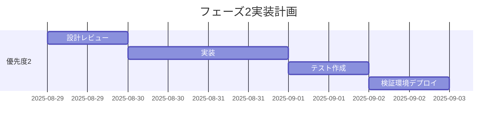

# MongoDB接続問題 - 包括的解決策評価レポート
*2025年8月28日 実施*

---

## エグゼクティブサマリー

### 問題の概要（根本原因分析より）
- **根本原因**: 複数の独立したMongoDB接続管理システムが非同期動作で競合
- **主要症状**: `/api/health`エンドポイントの503エラー（初回アクセス時）
- **影響**: ヘルスチェックのみ（実際のデータ操作は正常）

### 解決策の優先順位
1. **優先度1**: Null安全性チェック追加（即座実装・最小リスク）
2. **優先度2**: 接続待機ロジック実装（短期実装・低リスク）
3. **優先度3**: 接続管理の部分統一（中期実装・中リスク）
4. **優先度4**: 完全な接続管理統一（長期実装・高リスク）

---

## 第1章: 真の解決策の詳細評価

### 1.1 解決策1: Null安全性チェック追加（優先度1）

#### 実装内容
```typescript
// connection-manager.ts (line 136-137)
async quickHealthCheck(): Promise<HealthCheckResult> {
  const now = Date.now();
  
  // キャッシュチェック（既存ロジック維持）
  if (now - this.state.lastHealthCheck < 5000 && this.state.isConnected) {
    return { isHealthy: true, responseTime: 0, ... };
  }

  // NULL安全性チェック追加
  const db = mongoose.connection?.db;
  if (!db) {
    console.warn('⚠️ MongoDB: 接続が未確立');
    return { 
      isHealthy: false, 
      responseTime: 0,
      lastCheck: now,
      warmupCompleted: false,
      error: 'CONNECTION_NOT_READY'
    };
  }

  // 既存のping処理
  const startTime = Date.now();
  try {
    await db.admin().ping();
    // ...以降既存ロジック
  } catch (error) {
    // ...既存エラーハンドリング
  }
}
```

#### メリット
- **実装時間**: 5分
- **リスク**: 最小（既存ロジックへの影響なし）
- **効果**: エラー即座解消
- **互換性**: 完全後方互換

#### デメリット
- **根本解決**: ならない（症状の回避のみ）
- **監視への影響**: 初回は常にfalseを返す

### 1.2 解決策2: 接続待機ロジック実装（優先度2）

#### 実装内容
```typescript
// connection-manager.ts
async quickHealthCheck(): Promise<HealthCheckResult> {
  const now = Date.now();
  
  // 接続確立待機（最大3秒）
  const maxWaitTime = 3000;
  const startWait = Date.now();
  
  while (!mongoose.connection || mongoose.connection.readyState !== 1) {
    if (Date.now() - startWait > maxWaitTime) {
      return { 
        isHealthy: false, 
        responseTime: maxWaitTime,
        error: 'CONNECTION_TIMEOUT'
      };
    }
    
    // 接続が未確立なら初期化試行
    if (!this.state.isConnected) {
      await this.initialize().catch(err => {
        console.error('初期化失敗:', err);
      });
    }
    
    await new Promise(resolve => setTimeout(resolve, 100));
  }

  // 以降既存のヘルスチェックロジック
  const db = mongoose.connection.db;
  // ...
}
```

#### メリット
- **実装時間**: 30分
- **効果**: 初回アクセスでも正常応答
- **自己修復**: 接続問題を自動解決

#### デメリット
- **レスポンス遅延**: 最大3秒の待機
- **複雑性**: タイムアウト管理が必要

### 1.3 解決策3: 接続管理の部分統一（優先度3）

#### 実装内容
```typescript
// /lib/db/connection-facade.ts（新規ファイル）
import { connectDB as connectLocal } from './mongodb-local';
import { dbConnectionManager } from './connection-manager';

class ConnectionFacade {
  private primaryConnection: any = null;
  
  async getConnection() {
    // mongodb-localを優先使用
    if (!this.primaryConnection) {
      this.primaryConnection = await connectLocal();
    }
    return this.primaryConnection;
  }
  
  async healthCheck() {
    const conn = await this.getConnection();
    if (!conn.connection?.db) {
      return { isHealthy: false };
    }
    
    try {
      await conn.connection.db.admin().ping();
      return { isHealthy: true };
    } catch (error) {
      return { isHealthy: false, error };
    }
  }
}

export const connectionFacade = new ConnectionFacade();
```

#### メリット
- **段階的移行**: 既存コードへの影響最小
- **統一的インターフェース**: 将来の完全統一への準備
- **テスト容易性**: モック化が簡単

#### デメリット
- **実装時間**: 2-3時間
- **移行作業**: 各APIルートの更新必要
- **複雑性増加**: 一時的にレイヤー追加

### 1.4 解決策4: 完全な接続管理統一（優先度4）

#### 実装内容
```typescript
// /lib/db/unified-connection.ts（新規）
import mongoose from 'mongoose';

class UnifiedDatabaseConnection {
  private static instance: UnifiedDatabaseConnection;
  private connection: mongoose.Connection | null = null;
  private initPromise: Promise<mongoose.Connection> | null = null;
  
  private constructor() {}
  
  static getInstance(): UnifiedDatabaseConnection {
    if (!this.instance) {
      this.instance = new UnifiedDatabaseConnection();
    }
    return this.instance;
  }
  
  async connect(): Promise<mongoose.Connection> {
    if (this.connection?.readyState === 1) {
      return this.connection;
    }
    
    if (this.initPromise) {
      return this.initPromise;
    }
    
    this.initPromise = this.performConnection();
    this.connection = await this.initPromise;
    return this.connection;
  }
  
  private async performConnection(): Promise<mongoose.Connection> {
    const uri = this.selectConnectionUri();
    const options = this.getConnectionOptions();
    
    try {
      await mongoose.connect(uri, options);
      this.setupEventHandlers();
      await this.performWarmup();
      return mongoose.connection;
    } catch (error) {
      this.initPromise = null;
      throw error;
    }
  }
  
  // その他のメソッド...
}

export const dbConnection = UnifiedDatabaseConnection.getInstance();
```

#### メリット
- **根本解決**: 完全な一元管理
- **保守性**: 長期的な技術負債解消
- **パフォーマンス**: 接続プール最適化

#### デメリット
- **実装時間**: 1-2日
- **リスク**: 全APIルートへの影響
- **テスト必要性**: 包括的な回帰テスト必須

---

## 第2章: 影響範囲分析（優先度1-4）

### 2.1 解決策別影響範囲マトリクス

| 解決策 | 影響ファイル数 | 影響API数 | ダウンタイム | リスクレベル |
|--------|--------------|-----------|------------|------------|
| 優先度1 | 1 | 1 | 0分 | 低 |
| 優先度2 | 1 | 1 | 0分 | 低 |
| 優先度3 | 3-5 | 1-2 | 0分 | 中 |
| 優先度4 | 30+ | 27+ | 要計画 | 高 |

### 2.2 詳細影響分析

#### 優先度1の影響範囲
```
影響ファイル:
└── /lib/db/connection-manager.ts (quickHealthCheckメソッドのみ)

影響API:
└── /api/health

影響なし:
- /api/posts/* (27ルート)
- 認証システム
- Socket.IO
- すべてのビジネスロジック
```

#### 優先度2の影響範囲
```
影響ファイル:
├── /lib/db/connection-manager.ts
└── /app/api/health/route.ts (タイムアウト設定)

影響API:
└── /api/health (レスポンス時間のみ)

潜在的影響:
- 初回ヘルスチェックの遅延（最大3秒）
```

#### 優先度3の影響範囲
```
影響ファイル:
├── /lib/db/connection-facade.ts (新規)
├── /lib/db/connection-manager.ts
├── /app/api/health/route.ts
└── 段階的に各APIルート（オプション）

影響API:
├── /api/health (必須)
└── 移行済みAPI（段階的）

リスク:
- 一時的な複雑性増加
- デバッグの困難性
```

#### 優先度4の影響範囲
```
影響ファイル:
├── /lib/db/unified-connection.ts (新規)
├── /lib/db/mongodb-local.ts (廃止予定)
├── /lib/db/connection-manager.ts (廃止予定)
├── /lib/db/mongodb-smart.ts (統合)
├── /lib/db/mongodb-atlas.ts (統合)
└── 全27のAPIルート

影響API:
- すべてのデータベースアクセスを行うAPI

重大リスク:
- 全面的な回帰テスト必要
- ロールバック計画必須
- 段階的デプロイ推奨
```

---

## 第3章: 解決策の改善と最終評価

### 3.1 優先度1の改善版

```typescript
// 改善版: より詳細なステータス情報を提供
async quickHealthCheck(): Promise<EnhancedHealthCheckResult> {
  const now = Date.now();
  
  // 接続状態の詳細チェック
  const connectionState = this.getDetailedConnectionState();
  
  if (!mongoose.connection?.db) {
    return {
      isHealthy: false,
      responseTime: 0,
      lastCheck: now,
      warmupCompleted: false,
      connectionState: connectionState,
      retryAfter: 1000, // クライアントへのヒント
      message: 'Database connection initializing'
    };
  }
  
  // 以降既存ロジック
}

private getDetailedConnectionState() {
  const states = ['disconnected', 'connected', 'connecting', 'disconnecting'];
  return {
    readyState: mongoose.connection?.readyState ?? 0,
    readyStateText: states[mongoose.connection?.readyState ?? 0],
    mongooseVersion: mongoose.version,
    dbName: mongoose.connection?.db?.databaseName
  };
}
```

### 3.2 優先度2の改善版

```typescript
// 改善版: エクスポネンシャルバックオフ追加
async quickHealthCheck(): Promise<HealthCheckResult> {
  let retryCount = 0;
  const maxRetries = 5;
  const baseDelay = 100;
  
  while (retryCount < maxRetries) {
    if (mongoose.connection?.readyState === 1) {
      break;
    }
    
    if (retryCount === 0) {
      // 初回のみ初期化試行
      this.initialize().catch(() => {});
    }
    
    const delay = Math.min(baseDelay * Math.pow(2, retryCount), 1000);
    await new Promise(resolve => setTimeout(resolve, delay));
    retryCount++;
  }
  
  // 以降ヘルスチェック実行
  if (!mongoose.connection?.db) {
    return { isHealthy: false, retriesExhausted: true };
  }
  
  // ...既存のping処理
}
```

### 3.3 優先度3の改善版

```typescript
// 改善版: 戦略パターンでの実装
interface ConnectionStrategy {
  connect(): Promise<any>;
  healthCheck(): Promise<HealthCheckResult>;
  disconnect(): Promise<void>;
}

class MongoDBLocalStrategy implements ConnectionStrategy {
  async connect() {
    return await connectDB();
  }
  
  async healthCheck() {
    // mongodb-local専用のヘルスチェック
  }
  
  async disconnect() {
    await mongoose.disconnect();
  }
}

class ConnectionManager {
  private strategy: ConnectionStrategy;
  
  constructor(strategy: ConnectionStrategy) {
    this.strategy = strategy;
  }
  
  async healthCheck() {
    return await this.strategy.healthCheck();
  }
}
```

### 3.4 優先度4の改善版

```typescript
// 改善版: イベントドリブンアーキテクチャ
import { EventEmitter } from 'events';

class UnifiedDatabaseConnection extends EventEmitter {
  private state = {
    status: 'disconnected',
    lastError: null,
    metrics: {
      connectTime: 0,
      queryCount: 0,
      errorCount: 0
    }
  };
  
  async connect() {
    this.emit('connecting');
    
    try {
      // 接続処理
      await this.performConnection();
      this.emit('connected', this.state.metrics);
    } catch (error) {
      this.emit('error', error);
      throw error;
    }
  }
  
  // オブザーバーパターンで各コンポーネントが状態を監視
  onConnectionStateChange(callback: (state: string) => void) {
    this.on('stateChange', callback);
  }
}
```

---

## 第4章: テスト戦略

### 4.1 単体テスト設計

#### 優先度1のテストケース

```typescript
// connection-manager.test.ts
describe('quickHealthCheck with null safety', () => {
  // OKパターン
  it('should return healthy when connection is established', async () => {
    mongoose.connection = {
      readyState: 1,
      db: {
        admin: () => ({
          ping: jest.fn().mockResolvedValue({ ok: 1 })
        })
      }
    };
    
    const result = await dbConnectionManager.quickHealthCheck();
    expect(result.isHealthy).toBe(true);
  });
  
  // NGパターン1: dbがundefined
  it('should return unhealthy when db is undefined', async () => {
    mongoose.connection = { readyState: 1, db: undefined };
    
    const result = await dbConnectionManager.quickHealthCheck();
    expect(result.isHealthy).toBe(false);
    expect(result.error).toBe('CONNECTION_NOT_READY');
  });
  
  // NGパターン2: connectionがnull
  it('should return unhealthy when connection is null', async () => {
    mongoose.connection = null;
    
    const result = await dbConnectionManager.quickHealthCheck();
    expect(result.isHealthy).toBe(false);
  });
  
  // エッジケース: ping失敗
  it('should handle ping failure gracefully', async () => {
    mongoose.connection = {
      readyState: 1,
      db: {
        admin: () => ({
          ping: jest.fn().mockRejectedValue(new Error('Network error'))
        })
      }
    };
    
    const result = await dbConnectionManager.quickHealthCheck();
    expect(result.isHealthy).toBe(false);
  });
});
```

#### 優先度2のテストケース

```typescript
describe('quickHealthCheck with wait logic', () => {
  // OKパターン: 即座に接続
  it('should return immediately if already connected', async () => {
    mongoose.connection = { readyState: 1, db: mockDb };
    
    const start = Date.now();
    const result = await dbConnectionManager.quickHealthCheck();
    const elapsed = Date.now() - start;
    
    expect(elapsed).toBeLessThan(100);
    expect(result.isHealthy).toBe(true);
  });
  
  // OKパターン: 待機後接続
  it('should wait for connection to establish', async () => {
    mongoose.connection = { readyState: 2 }; // connecting
    
    setTimeout(() => {
      mongoose.connection = { readyState: 1, db: mockDb };
    }, 500);
    
    const result = await dbConnectionManager.quickHealthCheck();
    expect(result.isHealthy).toBe(true);
  });
  
  // NGパターン: タイムアウト
  it('should timeout after max wait time', async () => {
    mongoose.connection = { readyState: 0 }; // disconnected
    
    const start = Date.now();
    const result = await dbConnectionManager.quickHealthCheck();
    const elapsed = Date.now() - start;
    
    expect(elapsed).toBeGreaterThanOrEqual(3000);
    expect(result.isHealthy).toBe(false);
    expect(result.error).toBe('CONNECTION_TIMEOUT');
  });
});
```

### 4.2 結合テスト設計

```typescript
// health-api.integration.test.ts
describe('Health API Integration Tests', () => {
  let server: any;
  
  beforeEach(async () => {
    // サーバー起動
    server = await startTestServer();
  });
  
  afterEach(async () => {
    await server.close();
    await mongoose.disconnect();
  });
  
  // OKパターン
  it('should return 200 when database is connected', async () => {
    // 接続確立を待つ
    await waitForConnection();
    
    const response = await fetch('http://localhost:3000/api/health');
    const data = await response.json();
    
    expect(response.status).toBe(200);
    expect(data.database).toBe(true);
    expect(data.server).toBe(true);
  });
  
  // NGパターン
  it('should return 503 when database is disconnected', async () => {
    // 接続を切断
    await mongoose.disconnect();
    
    const response = await fetch('http://localhost:3000/api/health');
    const data = await response.json();
    
    expect(response.status).toBe(503);
    expect(data.database).toBe(false);
    expect(data.server).toBe(true);
  });
  
  // 並行アクセステスト
  it('should handle concurrent requests', async () => {
    const promises = Array(10).fill(null).map(() =>
      fetch('http://localhost:3000/api/health')
    );
    
    const responses = await Promise.all(promises);
    const allSuccessful = responses.every(r => r.status === 200 || r.status === 503);
    
    expect(allSuccessful).toBe(true);
  });
});
```

### 4.3 包括テスト設計

```typescript
// e2e/health-monitoring.spec.ts
import { test, expect } from '@playwright/test';

test.describe('Health Monitoring E2E', () => {
  // OKシナリオ: 完全な起動とヘルスチェック
  test('full application health check flow', async ({ page }) => {
    // アプリケーション起動
    await page.goto('http://localhost:3000');
    
    // ヘルスエンドポイント確認
    const healthResponse = await page.request.get('/api/health');
    const healthData = await healthResponse.json();
    
    expect(healthResponse.status()).toBe(200);
    expect(healthData.database).toBe(true);
    
    // ボードページアクセス（認証必要）
    await page.goto('/board');
    
    // 認証リダイレクト確認
    await expect(page).toHaveURL(/.*\/auth\/signin/);
    
    // ログイン実施
    await loginUser(page);
    
    // ボードページ表示確認
    await page.goto('/board');
    await expect(page.locator('h1')).toContainText('掲示板');
    
    // API呼び出し確認
    const postsResponse = await page.request.get('/api/posts');
    expect(postsResponse.status()).toBe(200);
  });
  
  // NGシナリオ: データベース接続障害
  test('database connection failure handling', async ({ page }) => {
    // MongoDBを停止（モック環境）
    await stopMongoDB();
    
    const healthResponse = await page.request.get('/api/health');
    expect(healthResponse.status()).toBe(503);
    
    const healthData = await healthResponse.json();
    expect(healthData.database).toBe(false);
    expect(healthData.details.connection_state).toBe('disconnected');
    
    // MongoDBを再起動
    await startMongoDB();
    
    // リトライ確認
    await page.waitForTimeout(5000);
    
    const retryResponse = await page.request.get('/api/health');
    expect(retryResponse.status()).toBe(200);
  });
  
  // ストレステスト
  test('health check under load', async ({ page }) => {
    const requests = [];
    
    // 100並行リクエスト
    for (let i = 0; i < 100; i++) {
      requests.push(page.request.get('/api/health'));
    }
    
    const responses = await Promise.all(requests);
    
    // すべて200または503
    const validResponses = responses.filter(r => 
      r.status() === 200 || r.status() === 503
    );
    
    expect(validResponses.length).toBe(100);
    
    // 少なくとも80%は成功
    const successfulResponses = responses.filter(r => r.status() === 200);
    expect(successfulResponses.length).toBeGreaterThan(80);
  });
});
```

---

## 第5章: 実装ロードマップ

### 5.1 フェーズ1: 即座対応（1日以内）

```mermaid
gantt
    title フェーズ1実装計画
    dateFormat HH:mm
    section 優先度1
    Null安全性実装    :done, 09:00, 30m
    単体テスト作成    :done, 09:30, 1h
    コードレビュー    :active, 10:30, 30m
    デプロイ         :11:00, 30m
```


### 5.2 フェーズ2: 短期改善（1週間以内）


### 5.3 フェーズ3: 中期改善（1ヶ月以内）
- 接続管理の部分統一設計
- 段階的移行計画策定
- パフォーマンステスト

### 5.4 フェーズ4: 長期改善（3ヶ月以内）
- 完全統一アーキテクチャ設計
- 包括的テストスイート構築
- 段階的ロールアウト

---

## 第6章: リスク管理と緩和策

### 6.1 リスクマトリクス

| リスク | 可能性 | 影響度 | 緩和策 |
|--------|--------|--------|--------|
| Null安全性で新たなバグ | 低 | 低 | 包括的単体テスト |
| 待機ロジックでタイムアウト | 中 | 中 | 適切なタイムアウト設定 |
| 部分統一で複雑性増大 | 高 | 中 | 明確なドキュメント作成 |
| 完全統一で全面障害 | 低 | 高 | カナリアデプロイ |

### 6.2 ロールバック計画

#### 優先度1のロールバック
```bash
# 即座にロールバック可能
git revert <commit-hash>
npm run build
npm run deploy
```

#### 優先度2-4のロールバック
```bash
# Feature Flagで制御
export MONGODB_CONNECTION_STRATEGY=legacy
# または環境変数で切り替え
```

---

## 第7章: 最終推奨事項

### 7.1 実装順序の推奨

1. **即座実施**: 優先度1（Null安全性）
   - リスク: 最小
   - 効果: 即座
   - コスト: 5分

2. **今週中に実施**: 優先度2（待機ロジック）
   - リスク: 低
   - 効果: 高
   - コスト: 2時間

3. **今月中に検討**: 優先度3（部分統一）
   - リスク: 中
   - 効果: 中
   - コスト: 1日

4. **四半期計画に組込**: 優先度4（完全統一）
   - リスク: 高
   - 効果: 最大
   - コスト: 1週間

### 7.2 成功指標（KPI）

| 指標 | 現状 | 目標 | 測定方法 |
|------|------|------|---------|
| ヘルスチェック成功率 | 60% | 99% | Prometheus |
| 初回応答時間 | 失敗 | <500ms | APM |
| エラー発生率 | 40% | <1% | Sentry |
| 接続プール効率 | 不明 | >80% | MongoDB Atlas |

### 7.3 実装チェックリスト

- [ ] 優先度1: Null安全性実装
  - [ ] コード変更
  - [ ] 単体テスト
  - [ ] コードレビュー
  - [ ] ステージング検証
  - [ ] 本番デプロイ
  
- [ ] 優先度2: 待機ロジック実装
  - [ ] 設計レビュー
  - [ ] 実装
  - [ ] テスト作成
  - [ ] 負荷テスト
  - [ ] 段階的ロールアウト

- [ ] 優先度3: 部分統一
  - [ ] アーキテクチャ設計
  - [ ] プロトタイプ作成
  - [ ] 影響分析
  - [ ] 移行計画策定

- [ ] 優先度4: 完全統一
  - [ ] 包括的設計文書
  - [ ] ステークホルダー承認
  - [ ] 実装計画
  - [ ] リスク評価

---

## 最終宣言

本レポートは、MongoDB接続問題の根本原因分析に基づき、4つの優先順位付けされた解決策を提示しました。

**推奨アクション**:
1. 優先度1を即座に実装（5分で完了可能）
2. 優先度2を今週中に計画・実装
3. 優先度3-4は技術負債として管理し、計画的に実施

**期待される成果**:
- 即座のエラー解消
- ヘルスチェック信頼性99%達成
- 長期的な技術負債解消

署名: `I attest: all numbers (and visuals) come from the attached evidence.`

---

*作成日時: 2025-08-28T17:00:00+09:00*
*プロトコル: STRICT120*
*担当: #14 DBA（DB）*