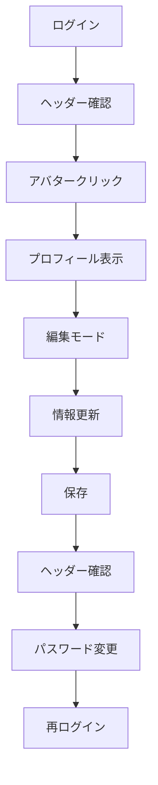

# 🎯 プロフィール機能 ビジュアルチェックリスト

## 実行前確認
```bash
# 1. MongoDB起動
mongod

# 2. 開発サーバー起動
npm run dev

# 3. 簡易チェック実行（推奨）
node quick-profile-check.js
```

---

## 📱 TEST FLOW

### 1️⃣ ログイン → ヘッダー確認

```
[ログイン画面]
📧 profile.test@example.com
🔑 Test1234!
    ↓
[ヘッダー表示]
┌─────────────────────────────────────┐
│ 会員制掲示板    掲示板  テストユーザーさん [◯テ] │
└─────────────────────────────────────┘
                                    ↑
                               アバターアイコン
```

**確認項目：**
- ✅ ユーザー名表示
- ✅ アバター表示（頭文字）
- ✅ クリック可能

---

### 2️⃣ アバターメニュー展開

```
クリック → メニュー表示
         ┌──────────────┐
         │ 👤 プロフィール  │
         │ ログアウト      │
         └──────────────┘
```

**確認項目：**
- ✅ メニュー表示
- ✅ プロフィールリンク
- ✅ ログアウトリンク

---

### 3️⃣ プロフィールページ表示

```
[プロフィールページ]
┌────────────────────────────────────────────┐
│  ┌───┐                                     │
│  │ テ │  プロフィール           [編集]      │
│  └───┘  アカウント情報の確認と編集          │
├────────────────────────────────────────────┤
│ 基本情報                                    │
│ ┌─────────────┐  ┌─────────────────────┐ │
│ │名前          │  │メールアドレス ✓確認済み│ │
│ │テストユーザー  │  │profile.test@...      │ │
│ └─────────────┘  └─────────────────────┘ │
│ ┌──────────────────────────────────────┐  │
│ │自己紹介                               │  │
│ │これはテスト用のプロフィールです。        │  │
│ └──────────────────────────────────────┘  │
├────────────────────────────────────────────┤
│ セキュリティ                                 │
│ パスワード                 [パスワード変更]   │
├────────────────────────────────────────────┤
│ アカウント情報                               │
│ 📅 アカウント作成日: 2025年8月13日           │
│ ✉️ メール確認状態: 確認済み                  │
└────────────────────────────────────────────┘
```

**確認項目：**
- ✅ アバター大サイズ表示
- ✅ 各情報の表示
- ✅ メール確認済みチップ
- ✅ 編集ボタン配置

---

### 4️⃣ 編集モード

```
[編集] クリック後
┌────────────────────────────────────────────┐
│  ┌───┐                                     │
│  │ テ │  プロフィール    [保存] [キャンセル] │
│  └───┘                                    │
├────────────────────────────────────────────┤
│ ┌─────────────────────┐                   │
│ │名前 ✏️              │ 10/50             │
│ │更新テストユーザー    │                   │
│ └─────────────────────┘                   │
│ ┌──────────────────────────────────────┐  │
│ │自己紹介 ✏️                          │  │
│ │プロフィールを更新しました。           │  │
│ │                               30/200│  │
│ └──────────────────────────────────────┘  │
│ ▓▓▓▓▓▓░░░░░░░░░░░░░░ (プログレスバー)      │
└────────────────────────────────────────────┘
```

**確認項目：**
- ✅ 編集可能状態
- ✅ 文字数カウンター
- ✅ プログレスバー
- ✅ 保存/キャンセルボタン

---

### 5️⃣ 保存成功時

```
┌────────────────────────────────────────────┐
│ ✅ プロフィールを更新しました              × │
└────────────────────────────────────────────┘

アバター更新: [テ] → [更]
ヘッダー更新: テストユーザーさん → 更新テストユーザーさん
```

**確認項目：**
- ✅ 成功メッセージ
- ✅ アバター変更
- ✅ ヘッダー名前更新

---

### 6️⃣ パスワード変更ダイアログ

```
┌─────────────────────────────────────┐
│ 🔒 パスワード変更                × │
├─────────────────────────────────────┤
│ 現在のパスワード         [👁]       │
│ ├─────────────────────────────┤    │
│                                     │
│ 新しいパスワード         [👁]       │
│ ├─────────────────────────────┤    │
│ 8文字以上、大文字・小文字・数字・    │
│ 特殊文字を含む                      │
│                                     │
│ 新しいパスワード（確認）  [👁]       │
│ ├─────────────────────────────┤    │
│                                     │
│        [キャンセル] [変更する]       │
└─────────────────────────────────────┘
```

**確認項目：**
- ✅ 3つのフィールド
- ✅ パスワード表示/非表示
- ✅ ヘルプテキスト
- ✅ ボタン配置

---

## 🔍 エラー状態の確認

### 文字数超過時
```
┌─────────────────────────────┐
│名前                    51/50│ ← 赤文字
│├──────────────────────────┤│
│❌ 名前は50文字以内で...     │
└─────────────────────────────┘
[保存] ← 無効化（グレーアウト）
```

### パスワード不一致時
```
┌─────────────────────────────┐
│新しいパスワード（確認）      │
│├──────────────────────────┤│
│❌ パスワードが一致しません   │
└─────────────────────────────┘
```

---

## 📱 レスポンシブ確認

### モバイル (375px)
```
┌─────────┐
│  [≡]    │ ← ハンバーガーメニュー
├─────────┤
│  ┌───┐  │
│  │ テ │  │ ← 中央配置
│  └───┘  │
│プロフィール│
├─────────┤
│ 名前     │
│ [     ]  │ ← 全幅
│          │
│ メール    │
│ [     ]  │ ← 全幅
└─────────┘
```

### タブレット (768px)
```
┌──────────────────┐
│ 基本情報          │
│ ┌─────┐ ┌─────┐ │
│ │名前  │ │メール│ │ ← 2列
│ └─────┘ └─────┘ │
│ ┌──────────────┐ │
│ │自己紹介       │ │ ← 全幅
│ └──────────────┘ │
└──────────────────┘
```

---

## ⚡ パフォーマンス目標

| 項目 | 目標時間 | 測定方法 |
|-----|---------|---------|
| ページ表示 | < 1秒 | Network タブ |
| API応答 | < 500ms | Console.time() |
| 保存処理 | < 2秒 | 体感時間 |
| 文字入力 | 遅延なし | リアルタイム |

---

## 🎬 最終確認フロー



---

## ✅ クイックチェックリスト

### 表示系
- [ ] ヘッダーにユーザー名
- [ ] アバター頭文字
- [ ] プロフィール情報表示
- [ ] メール確認済みバッジ

### 操作系
- [ ] アバターメニュー開閉
- [ ] 編集モード切替
- [ ] 文字入力スムーズ
- [ ] 保存ボタン動作

### フィードバック
- [ ] 成功メッセージ表示
- [ ] エラーメッセージ表示
- [ ] 文字数カウンター動作
- [ ] プログレスバー表示

### 更新反映
- [ ] ヘッダー名前更新
- [ ] アバター頭文字変更
- [ ] データ永続性（リロード後）
- [ ] 再ログイン後も保持

---

## 🚀 実行コマンド

```bash
# 自動チェック
node quick-profile-check.js

# 手動テスト開始
open http://localhost:3000

# ログイン情報
Email: profile.test@example.com
Password: Test1234!
```

---

実施日: ____________
実施者: ____________
結果: □ すべて正常 / □ 一部問題あり / □ 要修正