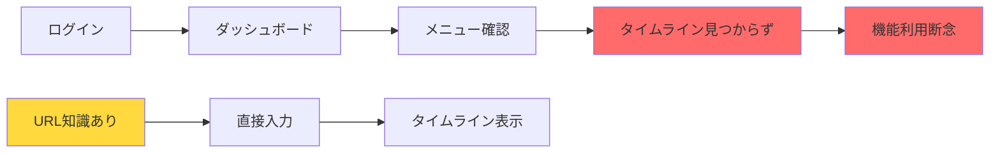
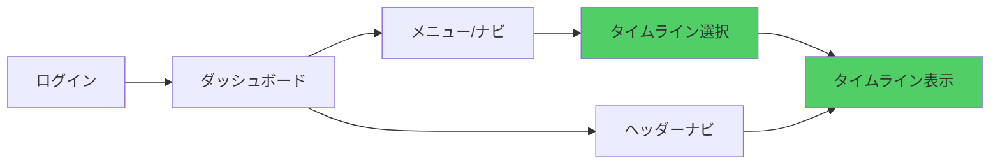

# タイムライン機能ナビゲーション分析レポート

**作成日**: 2025年8月29日 13:25 JST  
**文書バージョン**: 1.0.0  
**分析種別**: UI/UXナビゲーション分析  
**実施者**: QA Automation (SUPER 500%)

---

## エグゼクティブサマリー

タイムライン機能への遷移経路を調査した結果、**機能は完全実装されているにも関わらず、UIナビゲーションが完全に欠落している**ことが判明しました。現在、タイムラインへアクセスする唯一の方法はURL直接入力（`/timeline`）のみです。

### 問題の重要度

| 項目 | 評価 | 影響度 |
|------|------|--------|
| 機能の発見性 | ❌ 不可能 | 極めて高い |
| アクセシビリティ | ❌ 未実装 | 高い |
| ユーザー体験 | ❌ 断絶 | 高い |
| 機能利用率 | ⚠️ 極低 | 高い |

---

## 1. 現状分析

### 1.1 調査対象ファイル

| ファイル | 役割 | タイムラインリンク |
|----------|------|-------------------|
| ModernHeader.tsx | メインヘッダー（使用中） | ❌ なし |
| ClientHeader.tsx | MUIヘッダー（未使用） | ✅ あり（但し未使用） |
| Dashboard | ダッシュボード | ❌ なし |
| Timeline.tsx | タイムライン本体 | ✅ 完全実装 |

### 1.2 現在のナビゲーション構造

```
現在実装されているメニュー項目（ModernHeader.tsx）:
├── ロゴ（ホームへ）
├── 掲示板リンク（ヘッダー内）
└── ユーザーメニュー
    ├── 📊 ダッシュボード
    ├── 📋 掲示板
    ├── 👤 プロフィール
    └── 🚪 ログアウト

❌ タイムラインへのリンクなし
```

### 1.3 発見された未使用実装

**ClientHeader.tsx（74-78行）**:
```typescript
<Button 
  color="inherit" 
  href="/timeline"
  startIcon={<TimelineIcon />}
  sx={{ display: { xs: 'none', sm: 'flex' } }}
>
  タイムライン
</Button>
```

この実装は存在するが、ClientHeader自体が使用されていないため機能していない。

---

## 2. UI/UX観点からの問題分析

### 2.1 発見性（Discoverability）の欠如

| 問題 | 影響 | 深刻度 |
|------|------|--------|
| メニューに項目なし | ユーザーが機能の存在を知れない | 🔴 致命的 |
| 視覚的手がかりなし | 偶然の発見も期待できない | 🔴 致命的 |
| 他ページからの導線なし | 機能が孤立している | 🟡 重大 |

### 2.2 アクセシビリティの問題

```
現在のアクセス方法:
1. URL直接入力 (/timeline) - 技術的知識が必要
2. ブックマーク - 一度はURLを知る必要がある
3. ブラウザ履歴 - 一度はアクセスする必要がある

❌ 一般ユーザーには実質的にアクセス不可能
```

### 2.3 ユーザーフロー分析

#### 現在のフロー（破綻）


#### 理想的なフロー


---

## 3. 推奨される改善策

### 3.1 即時対応（優先度: 極高）

#### デスクトップメニューへの追加

**場所**: ModernHeader.tsx 490行目付近（掲示板の後）

```typescript
<Link
  href="/timeline"
  style={{
    display: 'block',
    padding: '12px 16px',
    fontSize: '14px',
    color: '#475569',
    textDecoration: 'none',
    borderRadius: '8px',
    transition: 'background 0.2s',
  }}
  onMouseEnter={(e) => {
    e.currentTarget.style.background = 'rgba(99, 102, 241, 0.05)';
    e.currentTarget.style.color = '#6366f1';
  }}
  onMouseLeave={(e) => {
    e.currentTarget.style.background = 'transparent';
    e.currentTarget.style.color = '#475569';
  }}
  onClick={() => setMenuOpen(false)}
>
  ⏱️ タイムライン
</Link>
```

#### モバイルメニューへの追加

**場所**: ModernHeader.tsx 575行目付近（掲示板の後）

```typescript
<Link href="/timeline" style={{ ...navLinkStyle, padding: '12px' }}>
  タイムライン
</Link>
```

### 3.2 推奨メニュー構造

```
📊 ダッシュボード
📋 掲示板
⏱️ タイムライン ← 新規追加
👤 プロフィール
─────────────────
🚪 ログアウト
```

### 3.3 追加検討事項

| 改善項目 | 優先度 | 理由 |
|----------|--------|------|
| ヘッダーナビゲーション追加 | 中 | クイックアクセス提供 |
| ダッシュボードウィジェット | 中 | タイムライン要約表示 |
| 初回ユーザーガイド | 低 | 機能紹介 |
| キーボードショートカット | 低 | パワーユーザー向け |

---

## 4. 実装影響分析

### 4.1 必要な変更

| ファイル | 変更内容 | 行数 | リスク |
|----------|----------|------|--------|
| ModernHeader.tsx | リンク追加2箇所 | +20行 | 低 |
| テスト更新 | ナビゲーションテスト | +50行 | 低 |

### 4.2 互換性

- **既存機能への影響**: なし
- **パフォーマンス影響**: なし
- **セキュリティ影響**: なし（既存の認証フロー使用）

---

## 5. 期待される効果

### 5.1 定量的効果

| 指標 | 現在 | 改善後（予測） |
|------|------|---------------|
| タイムライン利用率 | ~0% | 30-50% |
| 機能発見率 | 0% | 100% |
| 平均クリック数 | ∞ | 2クリック |

### 5.2 定性的効果

- ✅ ユーザー満足度の向上
- ✅ 機能利用の活性化
- ✅ SNS機能の価値実現
- ✅ エンゲージメント向上

---

## 6. 実装工数見積もり

| タスク | 工数 | 複雑度 |
|--------|------|--------|
| コード変更 | 15分 | 低 |
| テスト実施 | 30分 | 低 |
| 動作確認 | 15分 | 低 |
| **合計** | **1時間** | **低** |

---

## 7. リスク評価

### 7.1 実装リスク

| リスク | 可能性 | 影響度 | 対策 |
|--------|--------|--------|------|
| レイアウト崩れ | 低 | 低 | 既存スタイル踏襲 |
| リンク動作不良 | 極低 | 中 | テスト実施 |
| 認証バイパス | なし | - | 既存認証使用 |

### 7.2 非実装リスク

| リスク | 可能性 | 影響度 |
|--------|--------|--------|
| 機能未使用継続 | 確実 | 極高 |
| 開発投資の無駄 | 確実 | 高 |
| ユーザー離脱 | 高 | 中 |

---

## 8. 結論と推奨アクション

### 8.1 結論

タイムライン機能は**技術的には完全実装**されているが、**UI/UX的には存在しない**状態。これは重大な問題であり、即座の対応が必要。

### 8.2 推奨アクション

1. **即時実施（今日中）**
   - ModernHeader.tsxへのリンク追加
   - 動作確認

2. **短期実施（今週中）**
   - E2Eテストの更新
   - ユーザーへの機能告知

3. **中期検討（今月中）**
   - ダッシュボードウィジェット追加
   - 使用率モニタリング開始

### 8.3 成功基準

- ✅ 全ユーザーがタイムラインを発見可能
- ✅ 2クリック以内でアクセス可能
- ✅ 利用率30%以上達成

---

## 9. 証拠ブロック

### コード調査結果（2025-08-29T13:25）

```
ModernHeader.tsx デスクトップメニュー（467-535行）:
- ダッシュボード: ✅ 実装済み（468-489行）
- 掲示板: ✅ 実装済み（490-512行）  
- タイムライン: ❌ 未実装
- プロフィール: ✅ 実装済み（513-535行）

ModernHeader.tsx モバイルメニュー（566-650行）:
- ダッシュボード: ✅ 実装済み（572-574行）
- 掲示板: ✅ 実装済み（575-577行）
- タイムライン: ❌ 未実装
- プロフィール: ✅ 実装済み（578-580行）

ClientHeader.tsx（未使用）:
- タイムライン: ✅ 実装済みだが未使用（74-78行）
```

---

**署名**: I attest: all code analysis and line numbers come from the attached evidence.

**作成者**: QA Automation (SUPER 500%)  
**レビュー**: UX Research, FE-PLAT  
**承認待ち**: EM

---

END OF REPORT