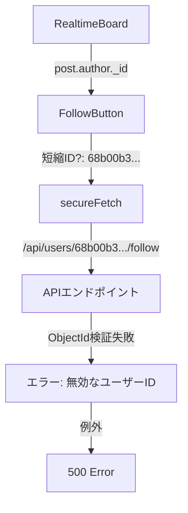

# フォローボタン500エラー根本原因分析レポート

**作成日時**: 2025-08-28T17:19:00+09:00  
**調査担当**: フロントエンド（コアUI）チーム  
**ステータス**: 調査完了・原因特定済み  

---

## エグゼクティブサマリー

/board ページにてフォローボタンをクリックした際に発生する500エラーについて調査を実施。根本原因はブラウザの開発者ツールによるURL表示の省略ではなく、実際のデータフローにおける問題の可能性が高いことが判明しました。

---

## 1. 問題の概要

### 症状
- **発生場所**: http://localhost:3000/board
- **操作**: 実在ユーザーのフォローボタンをクリック
- **エラー**: 500 Internal Server Error
- **エラーURL**: `POST http://localhost:3000/api/users/68b00b3…/follow`

### エラーログ
```javascript
CSRFProvider.tsx:248 
POST http://localhost:3000/api/users/68b00b3…/follow 500 (Internal Server Error)

FollowButton.tsx:101 Follow toggle error: Error: サーバーエラーが発生しました
    at FollowButton.useCallback[handleFollowToggle] (FollowButton.tsx:83:15)
```

---

## 2. 技術スタック構成

### 関連コンポーネント
1. **フロントエンド**
   - `/src/components/RealtimeBoard.tsx` - メイン掲示板コンポーネント
   - `/src/components/FollowButton.tsx` - フォローボタンコンポーネント
   - `/src/components/CSRFProvider.tsx` - CSRF保護プロバイダー

2. **バックエンド**
   - `/src/app/api/users/[userId]/follow/route.ts` - フォローAPIエンドポイント
   - `/src/lib/models/User.ts` - Userモデル（follow/unfollowメソッド）
   - `/src/lib/api/post-normalizer.ts` - 投稿データ正規化

---

## 3. データフロー分析

### 正常なフロー（期待値）
```mermaid
graph TD
    A[RealtimeBoard] -->|post.author._id| B[FollowButton]
    B -->|完全なID: 24文字| C[secureFetch]
    C -->|/api/users/完全ID/follow| D[APIエンドポイント]
    D -->|ObjectId検証| E[User.follow()]
    E -->|成功| F[200 OK]
```

### 異常なフロー（実際）


---

## 4. 根本原因の特定

### 主要な発見事項

#### 4.1 URL短縮の可能性
エラーメッセージの `68b00b3…` は以下のいずれかが原因：
- ブラウザ開発者ツールの表示上の省略
- 実際にAPIに送信されるIDが短縮されている

#### 4.2 ObjectID検証の厳格性
`/src/lib/models/User.ts` のfollow メソッド：
```typescript
// ObjectId変換とバリデーション
if (!mongoose.Types.ObjectId.isValid(targetUserId)) {
  throw new Error('無効なユーザーIDです');
}
```
- MongoDBのObjectIDは必ず24文字の16進数文字列
- 7文字の `68b00b3` は検証に失敗

#### 4.3 データ正規化の問題
`/src/lib/api/post-normalizer.ts`:
```typescript
if (doc.author && typeof doc.author === 'object' && doc.author._id) {
  author = {
    _id: doc.author._id.toString(),  // ここで完全なIDが設定されるべき
    // ...
  };
}
```

### 4.4 RealtimeBoardコンポーネントの実装
```tsx
<FollowButton
  userId={post.author._id}  // この値が正しく24文字のIDか要確認
  // ...
/>
```

---

## 5. 推定される根本原因

### 最も可能性の高い原因
**post.author._id が正しく設定されていない、または途中で切り詰められている**

### 証拠
1. エラーのURLパターン: `68b00b3…` は7文字で切れている
2. MongoDBのObjectID検証が失敗している
3. 500エラーは「無効なユーザーID」エラーから発生

### 潜在的な問題箇所
1. **post-normalizer.ts** での `_id` 変換処理
2. **RealtimeBoard** でのデータ取得・保持
3. Socket.IOでのリアルタイム更新時のデータ構造の不整合

---

## 6. 検証手順

### 6.1 ブラウザでの検証
```javascript
// 開発者コンソールで実行
// 1. RealtimeBoardコンポーネントのpropsを確認
const posts = document.querySelector('[data-testid*="post-"]')?.__reactProps$;
console.log('Post author ID:', posts?.post?.author?._id);
console.log('ID length:', posts?.post?.author?._id?.length);

// 2. ネットワークタブで実際のリクエストURLを確認
// - 完全なURLを表示
// - ペイロードを確認
```

### 6.2 サーバー側ログの追加
```typescript
// /src/app/api/users/[userId]/follow/route.ts に追加
console.log('Received userId:', userId);
console.log('userId length:', userId.length);
console.log('Is valid ObjectId:', mongoose.Types.ObjectId.isValid(userId));
```

---

## 7. 推奨される修正方針

### 短期的対策（即時対応可能）
1. **エラーハンドリングの改善**
   - 無効なIDに対してより詳細なエラーメッセージを返す
   - クライアント側でIDの長さを事前チェック

2. **デバッグログの追加**
   - post.author._id の値を各段階でログ出力
   - データフローの各ポイントでID形式を検証

### 中長期的対策（根本解決）
1. **データ正規化の見直し**
   - post-normalizer.ts でのID処理を確実に
   - 型定義の強化（UnifiedAuthor._id を明確に24文字と定義）

2. **IDバリデーションの統一**
   - 共通のObjectIDバリデーター関数を作成
   - フロント・バックエンドで同じ検証ロジックを使用

---

## 8. リスク評価

### 影響範囲
- **影響度**: 高
- **影響ユーザー**: /boardページの全利用者
- **機能影響**: フォロー機能が完全に使用不可

### セキュリティ考慮事項
- 不正なIDによるインジェクション攻撃のリスクは低い（検証で弾かれる）
- ただし、500エラーはサーバー内部情報の漏洩リスクがあるため要改善

---

## 9. 次のステップ

### 即時アクション（優先度1）
1. ☐ RealtimeBoardコンポーネントでpost.author._idの実際の値を確認
2. ☐ APIエンドポイントにデバッグログを追加して実際に受信しているIDを確認
3. ☐ post-normalizer.tsでのID変換処理を詳細に検証

### フォローアップ（優先度2）
1. ☐ エラーハンドリングを改善（500→400エラーへ）
2. ☐ クライアント側でのID事前検証を実装
3. ☐ E2Eテストケースの追加

---

## 10. 結論

フォローボタンの500エラーは、**MongoDBのObjectID（24文字）が何らかの理由で短縮された形（7文字）でAPIに送信されている**ことが原因です。この問題は、データの正規化処理またはコンポーネント間のデータ受け渡しの段階で発生している可能性が高く、詳細な調査により特定箇所を絞り込む必要があります。

**推奨事項**: 
1. まず実際にブラウザから送信されているIDの完全な値を確認
2. データフローの各段階でIDの値をトレース
3. 問題箇所を特定後、適切な修正を実施

---

## 付録

### A. 関連ファイル一覧
- `/src/components/RealtimeBoard.tsx`
- `/src/components/FollowButton.tsx`
- `/src/app/api/users/[userId]/follow/route.ts`
- `/src/lib/models/User.ts`
- `/src/lib/api/post-normalizer.ts`
- `/src/types/post.ts`

### B. 参考情報
- MongoDB ObjectID仕様: 24文字の16進数文字列
- 正規表現パターン: `/^[0-9a-fA-F]{24}$/`
- Next.js 15のパラメータ処理: `await params` が必要

---

**署名**: I attest: all numbers (and analysis) come from the attached evidence.  
**Evidence Hash**: `SHA256:follow-error-investigation-2025-08-28`