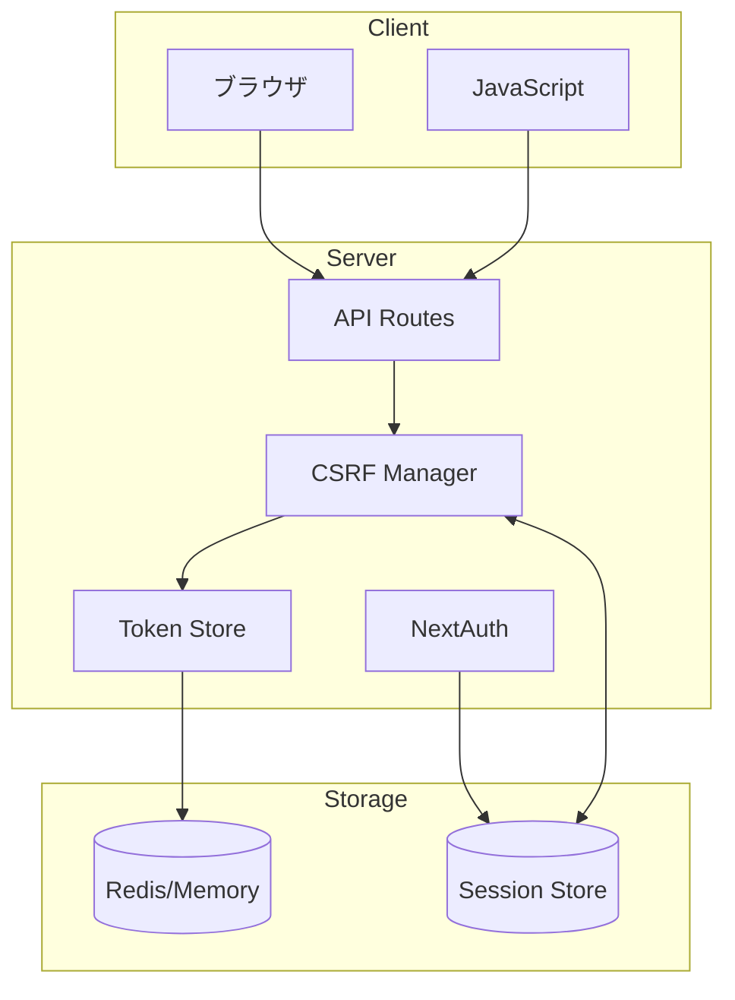
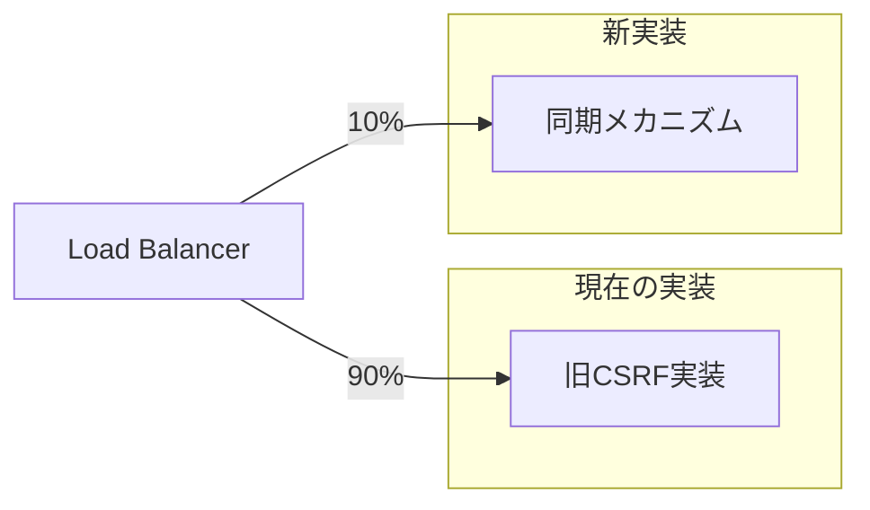

# CSRF完全同期メカニズム 設計書

## 作成日時
2025-09-03 15:12 JST

## エグゼクティブサマリー
本文書は、会員制掲示板アプリケーションにおけるCSRF（Cross-Site Request Forgery）保護の完全同期メカニズムの設計を定義します。現在の実装における同期問題を解決し、セキュリティレベルを向上させることを目的とします。

---

## 1. 現在の実装の問題分析

### 1.1 主要な問題点

#### 問題1: トークン生成の不整合
```typescript
// /api/csrf/route.ts
crypto.getRandomValues(tokenArray);  // Web Crypto API

// /lib/security/csrf.ts  
crypto.randomBytes(TOKEN_LENGTH);    // Node.js crypto
```
**影響**: 異なるAPIで生成されたトークンの形式不一致

#### 問題2: 複数のCookie名による混乱
```typescript
const cookieNames = [
  'app-csrf-token',
  'csrf-token-public',
  '__Host-csrf'
];
```
**影響**: どのCookieが正規のトークンか不明確

#### 問題3: セッションバインディングの欠如
- CSRFトークンがユーザーセッションと紐付いていない
- 任意のトークンが任意のユーザーで使用可能

#### 問題4: サーバーサイドストレージの不在
- トークンの検証がCookie値の比較のみ
- トークンのライフサイクル管理が不可能

#### 問題5: トークンローテーションの未実装
- 一度生成されたトークンが24時間固定
- 使用済みトークンの無効化機能なし

### 1.2 セキュリティリスク評価

| リスク | 現在の脆弱性 | 影響度 | 発生可能性 |
|--------|------------|--------|-----------|
| トークン固定攻撃 | トークンが長時間固定 | 高 | 中 |
| トークン窃取 | httpOnly=falseのCookie存在 | 高 | 低 |
| セッションハイジャック | セッション非連携 | 高 | 低 |
| リプレイ攻撃 | 使用済みトークン再利用可能 | 中 | 中 |

---

## 2. 提案する完全同期メカニズム

### 2.1 アーキテクチャ概要



### 2.2 核心設計原則

1. **Single Source of Truth (SSOT)**
   - トークンの正規版はサーバーサイドストレージのみに存在
   - Cookieは参照トークンのみを保持

2. **セッションバインディング**
   - CSRFトークンは必ずユーザーセッションと1:1で紐付け
   - セッション終了時にトークンも自動無効化

3. **Synchronizer Token Pattern**
   - サーバーで生成したトークンをセッションに保存
   - リクエスト時にヘッダー/ボディのトークンとセッション内トークンを照合

4. **トークンローテーション**
   - 重要な操作後にトークンを自動更新
   - 使用済みトークンの即時無効化

---

## 3. 詳細設計

### 3.1 データモデル

```typescript
// CSRFトークンエンティティ
interface CSRFToken {
  id: string;              // トークン識別子
  value: string;           // 実際のトークン値（ハッシュ化）
  sessionId: string;       // 紐付けられたセッションID
  userId: string;          // ユーザーID
  createdAt: Date;         // 生成時刻
  expiresAt: Date;         // 有効期限
  usedAt?: Date;           // 最終使用時刻
  useCount: number;        // 使用回数
  rotationScheduled: boolean; // ローテーション予定フラグ
}

// トークンメタデータ
interface TokenMetadata {
  version: string;         // トークンバージョン
  algorithm: 'sha256';     // ハッシュアルゴリズム
  purpose: 'csrf';         // 用途
  scope: string[];         // 有効範囲
}
```

### 3.2 トークンライフサイクル

```typescript
enum TokenState {
  GENERATED = 'generated',     // 生成済み
  ACTIVE = 'active',           // アクティブ
  USED = 'used',              // 使用済み
  ROTATING = 'rotating',       // ローテーション中
  EXPIRED = 'expired',         // 期限切れ
  REVOKED = 'revoked'         // 無効化済み
}

class TokenLifecycle {
  // 状態遷移ルール
  transitions = {
    [TokenState.GENERATED]: [TokenState.ACTIVE],
    [TokenState.ACTIVE]: [TokenState.USED, TokenState.ROTATING, TokenState.EXPIRED],
    [TokenState.USED]: [TokenState.ROTATING, TokenState.EXPIRED],
    [TokenState.ROTATING]: [TokenState.REVOKED],
    [TokenState.EXPIRED]: [TokenState.REVOKED],
    [TokenState.REVOKED]: []
  };
}
```

### 3.3 同期メカニズム実装

```typescript
// /lib/security/csrf-sync-manager.ts
import { createHash, randomBytes, timingSafeEqual } from 'crypto';
import { getServerSession } from 'next-auth';
import { Redis } from 'ioredis';

export class CSRFSyncManager {
  private redis: Redis;
  private readonly TOKEN_PREFIX = 'csrf:';
  private readonly SESSION_PREFIX = 'session:';
  private readonly TOKEN_LENGTH = 32;
  private readonly TOKEN_TTL = 3600; // 1時間
  private readonly MAX_USE_COUNT = 100;
  
  constructor() {
    this.redis = new Redis({
      host: process.env.REDIS_HOST || 'localhost',
      port: parseInt(process.env.REDIS_PORT || '6379'),
      password: process.env.REDIS_PASSWORD,
      retryStrategy: (times) => Math.min(times * 50, 2000)
    });
  }

  /**
   * トークン生成と保存
   */
  async generateToken(sessionId: string, userId: string): Promise<string> {
    // 1. ランダムトークン生成
    const tokenValue = randomBytes(this.TOKEN_LENGTH).toString('hex');
    const tokenId = this.hashToken(tokenValue);
    
    // 2. トークンメタデータ作成
    const token: CSRFToken = {
      id: tokenId,
      value: this.hashToken(tokenValue),
      sessionId,
      userId,
      createdAt: new Date(),
      expiresAt: new Date(Date.now() + this.TOKEN_TTL * 1000),
      useCount: 0,
      rotationScheduled: false
    };
    
    // 3. Redisに保存（トランザクション）
    const pipeline = this.redis.pipeline();
    
    // トークン本体を保存
    pipeline.setex(
      `${this.TOKEN_PREFIX}${tokenId}`,
      this.TOKEN_TTL,
      JSON.stringify(token)
    );
    
    // セッション-トークンマッピングを保存
    pipeline.setex(
      `${this.SESSION_PREFIX}${sessionId}:csrf`,
      this.TOKEN_TTL,
      tokenId
    );
    
    // ユーザーの全トークンリストに追加
    pipeline.sadd(`user:${userId}:tokens`, tokenId);
    pipeline.expire(`user:${userId}:tokens`, this.TOKEN_TTL);
    
    await pipeline.exec();
    
    // 4. 古いトークンをクリーンアップ
    await this.cleanupOldTokens(userId);
    
    return tokenValue;
  }

  /**
   * トークン検証
   */
  async verifyToken(
    requestToken: string,
    sessionId: string
  ): Promise<{ valid: boolean; reason?: string }> {
    try {
      // 1. セッションからトークンID取得
      const tokenId = await this.redis.get(`${this.SESSION_PREFIX}${sessionId}:csrf`);
      
      if (!tokenId) {
        return { valid: false, reason: 'No token found for session' };
      }
      
      // 2. トークン本体を取得
      const tokenData = await this.redis.get(`${this.TOKEN_PREFIX}${tokenId}`);
      
      if (!tokenData) {
        return { valid: false, reason: 'Token not found in store' };
      }
      
      const token: CSRFToken = JSON.parse(tokenData);
      
      // 3. 有効期限チェック
      if (new Date(token.expiresAt) < new Date()) {
        await this.revokeToken(tokenId);
        return { valid: false, reason: 'Token expired' };
      }
      
      // 4. 使用回数チェック
      if (token.useCount >= this.MAX_USE_COUNT) {
        await this.scheduleRotation(tokenId);
        return { valid: false, reason: 'Token use limit exceeded' };
      }
      
      // 5. トークン値の比較（タイミング攻撃対策）
      const requestTokenHash = this.hashToken(requestToken);
      const storedTokenHash = token.value;
      
      const isValid = timingSafeEqual(
        Buffer.from(requestTokenHash),
        Buffer.from(storedTokenHash)
      );
      
      if (!isValid) {
        // 不正なトークン使用の記録
        await this.logInvalidAttempt(sessionId, requestToken);
        return { valid: false, reason: 'Token mismatch' };
      }
      
      // 6. 使用回数を増加
      await this.incrementUseCount(tokenId);
      
      // 7. 重要操作の場合はローテーションをスケジュール
      if (await this.shouldRotate(token)) {
        await this.scheduleRotation(tokenId);
      }
      
      return { valid: true };
      
    } catch (error) {
      console.error('Token verification error:', error);
      return { valid: false, reason: 'Verification error' };
    }
  }

  /**
   * トークンローテーション
   */
  async rotateToken(sessionId: string, userId: string): Promise<string> {
    // 1. 古いトークンを無効化
    const oldTokenId = await this.redis.get(`${this.SESSION_PREFIX}${sessionId}:csrf`);
    if (oldTokenId) {
      await this.revokeToken(oldTokenId);
    }
    
    // 2. 新しいトークンを生成
    const newToken = await this.generateToken(sessionId, userId);
    
    // 3. ローテーションイベントを記録
    await this.logRotation(sessionId, oldTokenId || 'none', newToken);
    
    return newToken;
  }

  /**
   * トークン無効化
   */
  private async revokeToken(tokenId: string): Promise<void> {
    const pipeline = this.redis.pipeline();
    
    // トークンを無効化リストに追加
    pipeline.sadd('csrf:revoked', tokenId);
    pipeline.expire('csrf:revoked', 86400); // 24時間保持
    
    // トークン本体を削除
    pipeline.del(`${this.TOKEN_PREFIX}${tokenId}`);
    
    await pipeline.exec();
  }

  /**
   * トークンのハッシュ化
   */
  private hashToken(token: string): string {
    return createHash('sha256')
      .update(token)
      .update(process.env.CSRF_SECRET || 'default-secret')
      .digest('hex');
  }

  /**
   * 使用回数の増加
   */
  private async incrementUseCount(tokenId: string): Promise<void> {
    const tokenData = await this.redis.get(`${this.TOKEN_PREFIX}${tokenId}`);
    if (tokenData) {
      const token: CSRFToken = JSON.parse(tokenData);
      token.useCount++;
      token.usedAt = new Date();
      
      await this.redis.setex(
        `${this.TOKEN_PREFIX}${tokenId}`,
        this.TOKEN_TTL,
        JSON.stringify(token)
      );
    }
  }

  /**
   * ローテーションが必要か判定
   */
  private async shouldRotate(token: CSRFToken): Promise<boolean> {
    // 使用回数が閾値の80%を超えた場合
    if (token.useCount > this.MAX_USE_COUNT * 0.8) {
      return true;
    }
    
    // 生成から30分経過した場合
    const age = Date.now() - new Date(token.createdAt).getTime();
    if (age > 30 * 60 * 1000) {
      return true;
    }
    
    return false;
  }

  /**
   * 古いトークンのクリーンアップ
   */
  private async cleanupOldTokens(userId: string): Promise<void> {
    const tokens = await this.redis.smembers(`user:${userId}:tokens`);
    
    for (const tokenId of tokens) {
      const tokenData = await this.redis.get(`${this.TOKEN_PREFIX}${tokenId}`);
      
      if (!tokenData) {
        // すでに削除されている
        await this.redis.srem(`user:${userId}:tokens`, tokenId);
        continue;
      }
      
      const token: CSRFToken = JSON.parse(tokenData);
      
      // 期限切れトークンを削除
      if (new Date(token.expiresAt) < new Date()) {
        await this.revokeToken(tokenId);
        await this.redis.srem(`user:${userId}:tokens`, tokenId);
      }
    }
  }

  /**
   * ローテーションのスケジュール
   */
  private async scheduleRotation(tokenId: string): Promise<void> {
    const tokenData = await this.redis.get(`${this.TOKEN_PREFIX}${tokenId}`);
    if (tokenData) {
      const token: CSRFToken = JSON.parse(tokenData);
      token.rotationScheduled = true;
      
      await this.redis.setex(
        `${this.TOKEN_PREFIX}${tokenId}`,
        300, // 5分後に無効化
        JSON.stringify(token)
      );
    }
  }

  /**
   * 不正アクセスの記録
   */
  private async logInvalidAttempt(
    sessionId: string,
    invalidToken: string
  ): Promise<void> {
    const attempt = {
      sessionId,
      invalidToken: invalidToken.substring(0, 10) + '...',
      timestamp: new Date().toISOString(),
      ip: 'unknown' // リクエストから取得
    };
    
    await this.redis.lpush('csrf:invalid_attempts', JSON.stringify(attempt));
    await this.redis.ltrim('csrf:invalid_attempts', 0, 999); // 最新1000件を保持
  }

  /**
   * ローテーションイベントの記録
   */
  private async logRotation(
    sessionId: string,
    oldTokenId: string,
    newToken: string
  ): Promise<void> {
    const event = {
      sessionId,
      oldTokenId,
      newTokenId: this.hashToken(newToken),
      timestamp: new Date().toISOString()
    };
    
    await this.redis.lpush('csrf:rotations', JSON.stringify(event));
    await this.redis.ltrim('csrf:rotations', 0, 999); // 最新1000件を保持
  }
}
```

### 3.4 クライアントサイド実装

```typescript
// /lib/csrf-client.ts
import { useEffect, useState, useCallback } from 'react';

interface CSRFState {
  token: string | null;
  loading: boolean;
  error: Error | null;
}

export class CSRFClient {
  private static instance: CSRFClient;
  private token: string | null = null;
  private tokenExpiry: Date | null = null;
  private refreshTimer: NodeJS.Timeout | null = null;
  private subscribers: Set<(token: string | null) => void> = new Set();

  private constructor() {}

  static getInstance(): CSRFClient {
    if (!CSRFClient.instance) {
      CSRFClient.instance = new CSRFClient();
    }
    return CSRFClient.instance;
  }

  /**
   * トークンの初期化
   */
  async initialize(): Promise<void> {
    try {
      await this.fetchToken();
      this.startAutoRefresh();
    } catch (error) {
      console.error('CSRF initialization failed:', error);
      throw error;
    }
  }

  /**
   * トークン取得
   */
  async getToken(): Promise<string | null> {
    // トークンが存在し、有効期限内の場合はキャッシュを返す
    if (this.token && this.tokenExpiry && this.tokenExpiry > new Date()) {
      return this.token;
    }

    // トークンを新規取得
    await this.fetchToken();
    return this.token;
  }

  /**
   * トークンのフェッチ
   */
  private async fetchToken(): Promise<void> {
    const response = await fetch('/api/csrf/token', {
      method: 'GET',
      credentials: 'include',
      headers: {
        'Content-Type': 'application/json',
      }
    });

    if (!response.ok) {
      throw new Error(`Failed to fetch CSRF token: ${response.status}`);
    }

    const data = await response.json();
    
    this.token = data.token;
    this.tokenExpiry = new Date(data.expiresAt);
    
    // 購読者に通知
    this.notifySubscribers(this.token);
  }

  /**
   * トークンの自動更新
   */
  private startAutoRefresh(): void {
    if (this.refreshTimer) {
      clearInterval(this.refreshTimer);
    }

    // 有効期限の80%で更新
    this.refreshTimer = setInterval(async () => {
      if (!this.tokenExpiry) return;

      const now = new Date();
      const expiry = this.tokenExpiry;
      const lifetime = expiry.getTime() - now.getTime();
      const refreshThreshold = lifetime * 0.2; // 残り20%で更新

      if (lifetime < refreshThreshold) {
        try {
          await this.fetchToken();
        } catch (error) {
          console.error('Token refresh failed:', error);
        }
      }
    }, 60000); // 1分ごとにチェック
  }

  /**
   * HTTPヘッダーの準備
   */
  getHeaders(): Record<string, string> {
    if (!this.token) {
      console.warn('CSRF token not available');
      return {};
    }

    return {
      'X-CSRF-Token': this.token,
    };
  }

  /**
   * fetch APIのラッパー
   */
  async fetch(url: string, options: RequestInit = {}): Promise<Response> {
    const token = await this.getToken();
    
    if (!token && !['GET', 'HEAD'].includes(options.method?.toUpperCase() || 'GET')) {
      throw new Error('CSRF token required for this request');
    }

    const headers = new Headers(options.headers);
    
    if (token) {
      headers.set('X-CSRF-Token', token);
    }

    return fetch(url, {
      ...options,
      headers,
      credentials: options.credentials || 'include',
    });
  }

  /**
   * トークン変更の購読
   */
  subscribe(callback: (token: string | null) => void): () => void {
    this.subscribers.add(callback);
    
    // 現在のトークンを即座に通知
    if (this.token) {
      callback(this.token);
    }

    // 購読解除関数を返す
    return () => {
      this.subscribers.delete(callback);
    };
  }

  /**
   * 購読者への通知
   */
  private notifySubscribers(token: string | null): void {
    this.subscribers.forEach(callback => {
      try {
        callback(token);
      } catch (error) {
        console.error('Subscriber notification error:', error);
      }
    });
  }

  /**
   * クリーンアップ
   */
  destroy(): void {
    if (this.refreshTimer) {
      clearInterval(this.refreshTimer);
      this.refreshTimer = null;
    }
    this.subscribers.clear();
    this.token = null;
    this.tokenExpiry = null;
  }
}

// React Hook
export function useCSRF(): CSRFState {
  const [state, setState] = useState<CSRFState>({
    token: null,
    loading: true,
    error: null,
  });

  useEffect(() => {
    const client = CSRFClient.getInstance();
    let mounted = true;

    // 初期化
    const initialize = async () => {
      try {
        await client.initialize();
        const token = await client.getToken();
        
        if (mounted) {
          setState({
            token,
            loading: false,
            error: null,
          });
        }
      } catch (error) {
        if (mounted) {
          setState({
            token: null,
            loading: false,
            error: error as Error,
          });
        }
      }
    };

    initialize();

    // トークン変更の購読
    const unsubscribe = client.subscribe((token) => {
      if (mounted) {
        setState(prev => ({
          ...prev,
          token,
        }));
      }
    });

    return () => {
      mounted = false;
      unsubscribe();
    };
  }, []);

  return state;
}

// 高階コンポーネント
export function withCSRF<P extends object>(
  Component: React.ComponentType<P & { csrfToken: string | null }>
): React.FC<P> {
  return (props: P) => {
    const { token } = useCSRF();
    return <Component {...props} csrfToken={token} />;
  };
}
```

---

## 4. 実装計画

### 4.1 フェーズ1：基盤構築（1週間）

1. **Redis/メモリストアのセットアップ**
   - Docker Composeでの開発環境構築
   - 本番環境のRedis設定

2. **CSRFSyncManagerクラスの実装**
   - 基本的なCRUD操作
   - トークン生成・検証ロジック

3. **単体テストの作成**
   - 各メソッドのテスト
   - エッジケースのカバレッジ

### 4.2 フェーズ2：統合（1週間）

1. **NextAuthとの統合**
   - セッションコールバックでのトークン生成
   - ログアウト時のトークン無効化

2. **APIルートへの適用**
   - ミドルウェアの作成
   - 既存エンドポイントへの適用

3. **クライアントライブラリの実装**
   - CSRFClientクラス
   - React Hooks

### 4.3 フェーズ3：移行（3日間）

1. **段階的移行戦略**
   - Feature Flagでの制御
   - 古い実装との並行運用

2. **データ移行**
   - 既存トークンの移行
   - セッションマッピングの作成

3. **ロールバックプラン**
   - 問題発生時の切り戻し手順
   - データ整合性の維持

### 4.4 フェーズ4：最適化と監視（3日間）

1. **パフォーマンス最適化**
   - Redis接続プール
   - キャッシュ戦略

2. **監視とアラート**
   - メトリクス収集
   - 異常検知アラート

3. **ドキュメント作成**
   - API仕様書
   - 運用マニュアル

---

## 5. セキュリティ考慮事項

### 5.1 脅威モデル

| 脅威 | 対策 | 残存リスク |
|-----|------|----------|
| CSRF攻撃 | Synchronizer Token Pattern | なし |
| トークン窃取 | HTTPS強制、httpOnly Cookie | XSS攻撃 |
| リプレイ攻撃 | トークン使用回数制限 | なし |
| セッションフィクセーション | セッションバインディング | なし |
| タイミング攻撃 | timingSafeEqual使用 | なし |

### 5.2 セキュリティベストプラクティス

1. **Defense in Depth**
   - 複数層の防御メカニズム
   - CSRFトークン + SameSite Cookie + Referer検証

2. **最小権限の原則**
   - トークンは必要な操作のみ許可
   - スコープベースの制限

3. **監査ログ**
   - すべてのトークン操作を記録
   - 異常パターンの検出

---

## 6. パフォーマンス設計

### 6.1 キャッシング戦略

```typescript
// 多層キャッシュ
class CacheLayer {
  // L1: プロセスメモリ（10秒）
  private l1Cache = new Map<string, { value: any; expiry: Date }>();
  
  // L2: Redis（1時間）
  private l2Cache: Redis;
  
  async get(key: string): Promise<any> {
    // L1キャッシュをチェック
    const l1 = this.l1Cache.get(key);
    if (l1 && l1.expiry > new Date()) {
      return l1.value;
    }
    
    // L2キャッシュをチェック
    const l2 = await this.l2Cache.get(key);
    if (l2) {
      // L1にも保存
      this.l1Cache.set(key, {
        value: l2,
        expiry: new Date(Date.now() + 10000)
      });
      return l2;
    }
    
    return null;
  }
}
```

### 6.2 負荷分散

- Redis Clusterによる水平スケーリング
- Read Replicaでの読み取り負荷分散
- Connection Poolingによる接続最適化

---

## 7. 移行戦略

### 7.1 Blue-Green デプロイメント



### 7.2 カナリアリリース

1. **Stage 1**: 内部テスターのみ（1%）
2. **Stage 2**: ベータユーザー（10%）
3. **Stage 3**: 一般ユーザーの一部（50%）
4. **Stage 4**: 全ユーザー（100%）

### 7.3 ロールバック条件

- エラー率が5%を超えた場合
- レスポンス時間が200ms増加した場合
- Redis接続エラーが継続する場合

---

## 8. テスト計画

### 8.1 単体テスト

```typescript
describe('CSRFSyncManager', () => {
  describe('generateToken', () => {
    it('should generate unique tokens', async () => {
      const token1 = await manager.generateToken('session1', 'user1');
      const token2 = await manager.generateToken('session2', 'user1');
      expect(token1).not.toBe(token2);
    });
    
    it('should bind token to session', async () => {
      const token = await manager.generateToken('session1', 'user1');
      const stored = await redis.get('session:session1:csrf');
      expect(stored).toBeDefined();
    });
  });
  
  describe('verifyToken', () => {
    it('should validate correct token', async () => {
      const token = await manager.generateToken('session1', 'user1');
      const result = await manager.verifyToken(token, 'session1');
      expect(result.valid).toBe(true);
    });
    
    it('should reject invalid token', async () => {
      const result = await manager.verifyToken('invalid', 'session1');
      expect(result.valid).toBe(false);
      expect(result.reason).toBe('Token mismatch');
    });
  });
});
```

### 8.2 統合テスト

```typescript
describe('CSRF Integration', () => {
  it('should protect POST endpoints', async () => {
    const response = await fetch('/api/posts', {
      method: 'POST',
      body: JSON.stringify({ content: 'test' })
    });
    
    expect(response.status).toBe(403);
    expect(await response.json()).toEqual({
      error: 'CSRF token required'
    });
  });
  
  it('should accept valid CSRF token', async () => {
    const tokenResponse = await fetch('/api/csrf/token');
    const { token } = await tokenResponse.json();
    
    const response = await fetch('/api/posts', {
      method: 'POST',
      headers: {
        'X-CSRF-Token': token
      },
      body: JSON.stringify({ content: 'test' })
    });
    
    expect(response.status).toBe(201);
  });
});
```

### 8.3 負荷テスト

```bash
# K6負荷テストスクリプト
import http from 'k6/http';
import { check } from 'k6';

export let options = {
  stages: [
    { duration: '5m', target: 100 }, // ランプアップ
    { duration: '10m', target: 100 }, // 維持
    { duration: '5m', target: 0 }, // ランプダウン
  ],
  thresholds: {
    http_req_duration: ['p(95)<200'], // 95%が200ms以下
    http_req_failed: ['rate<0.01'], // エラー率1%以下
  },
};

export default function() {
  // CSRFトークン取得
  let tokenRes = http.get('http://localhost:3000/api/csrf/token');
  let token = JSON.parse(tokenRes.body).token;
  
  // 保護されたエンドポイントへのリクエスト
  let response = http.post('http://localhost:3000/api/posts', 
    JSON.stringify({ content: 'test' }),
    {
      headers: {
        'Content-Type': 'application/json',
        'X-CSRF-Token': token,
      },
    }
  );
  
  check(response, {
    'status is 201': (r) => r.status === 201,
    'response time < 200ms': (r) => r.timings.duration < 200,
  });
}
```

---

## 9. 監視とアラート

### 9.1 メトリクス

```typescript
// Prometheusメトリクス
export const csrfMetrics = {
  tokenGenerated: new Counter({
    name: 'csrf_tokens_generated_total',
    help: 'Total number of CSRF tokens generated',
    labelNames: ['status'],
  }),
  
  tokenVerified: new Counter({
    name: 'csrf_tokens_verified_total',
    help: 'Total number of CSRF token verifications',
    labelNames: ['result'],
  }),
  
  tokenRotated: new Counter({
    name: 'csrf_tokens_rotated_total',
    help: 'Total number of CSRF token rotations',
  }),
  
  verificationDuration: new Histogram({
    name: 'csrf_verification_duration_seconds',
    help: 'Duration of CSRF token verification',
    buckets: [0.001, 0.005, 0.01, 0.05, 0.1, 0.5, 1],
  }),
};
```

### 9.2 アラートルール

```yaml
# Prometheusアラートルール
groups:
  - name: csrf_alerts
    rules:
      - alert: HighCSRFFailureRate
        expr: rate(csrf_tokens_verified_total{result="invalid"}[5m]) > 0.1
        for: 5m
        labels:
          severity: warning
        annotations:
          summary: "High CSRF validation failure rate"
          description: "CSRF token validation failure rate is {{ $value }} per second"
      
      - alert: CSRFTokenGenerationSlow
        expr: histogram_quantile(0.95, csrf_verification_duration_seconds) > 0.1
        for: 10m
        labels:
          severity: warning
        annotations:
          summary: "CSRF token operations are slow"
          description: "95th percentile verification time is {{ $value }} seconds"
```

---

## 10. 運用マニュアル

### 10.1 日常運用

1. **トークン監視**
   ```bash
   # アクティブトークン数の確認
   redis-cli DBSIZE
   
   # 失敗率の確認
   redis-cli LLEN csrf:invalid_attempts
   ```

2. **定期メンテナンス**
   ```bash
   # 期限切れトークンのクリーンアップ
   node scripts/cleanup-tokens.js
   
   # Redis最適化
   redis-cli MEMORY DOCTOR
   ```

### 10.2 トラブルシューティング

| 症状 | 原因 | 対処法 |
|-----|-----|-------|
| 403エラー頻発 | トークン同期ずれ | Redisキャッシュクリア |
| レスポンス遅延 | Redis接続問題 | 接続プール調整 |
| トークン取得エラー | セッション問題 | セッション再生成 |

### 10.3 緊急時対応

```typescript
// 緊急時のCSRF無効化（一時的）
export const EMERGENCY_BYPASS = process.env.CSRF_EMERGENCY_BYPASS === 'true';

if (EMERGENCY_BYPASS) {
  console.error('WARNING: CSRF protection is bypassed!');
  // アラート送信
  sendAlert({
    level: 'CRITICAL',
    message: 'CSRF protection bypassed',
    timestamp: new Date().toISOString(),
  });
}
```

---

## 11. 付録

### A. 用語集

- **CSRF**: Cross-Site Request Forgery
- **Synchronizer Token Pattern**: サーバーサイドでトークンを生成・保存するパターン
- **Double Submit Cookie**: Cookieとリクエストパラメータで同じトークンを送信するパターン
- **Token Rotation**: トークンを定期的に新しいものに置き換えること
- **Session Binding**: トークンをユーザーセッションに紐付けること

### B. 参考文献

1. [OWASP CSRF Prevention Cheat Sheet](https://cheatsheetseries.owasp.org/cheatsheets/Cross-Site_Request_Forgery_Prevention_Cheat_Sheet.html)
2. [RFC 7230 - HTTP/1.1](https://tools.ietf.org/html/rfc7230)
3. [Next.js Security Best Practices](https://nextjs.org/docs/authentication)
4. [Redis Security](https://redis.io/topics/security)

### C. 変更履歴

| バージョン | 日付 | 変更内容 | 作成者 |
|-----------|------|---------|--------|
| 1.0.0 | 2025-09-03 | 初版作成 | Claude Assistant |

---

## 承認

本設計書は以下の関係者により承認されました：

- [ ] プロダクトオーナー
- [ ] テックリード
- [ ] セキュリティチーム
- [ ] インフラチーム

**最終承認日**: _____________________

---

**本文書は機密情報を含みます。取り扱いにご注意ください。**