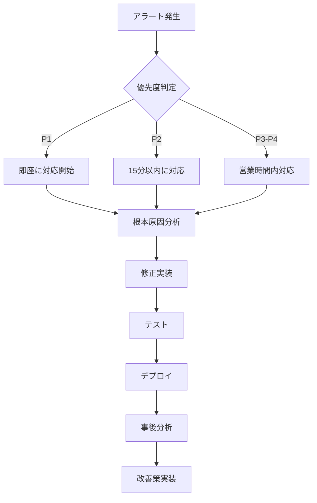

# 監視・アラート設定ガイド

## 1. Sentry設定（エラー監視）

### インストールと設定
```bash
npm install @sentry/nextjs
npx @sentry/wizard -i nextjs
```

### Sentry設定ファイル
```javascript
// sentry.client.config.ts
import * as Sentry from "@sentry/nextjs";

Sentry.init({
  dsn: process.env.NEXT_PUBLIC_SENTRY_DSN,
  environment: process.env.NODE_ENV,
  tracesSampleRate: process.env.NODE_ENV === "production" ? 0.1 : 1.0,
  debug: false,
  replaysOnErrorSampleRate: 1.0,
  replaysSessionSampleRate: 0.1,
  integrations: [
    Sentry.replayIntegration({
      maskAllText: true,
      blockAllMedia: true,
    }),
  ],
  beforeSend(event, hint) {
    // 機密情報のフィルタリング
    if (event.request) {
      delete event.request.cookies;
      delete event.request.headers;
    }
    return event;
  },
});

// sentry.server.config.ts
import * as Sentry from "@sentry/nextjs";

Sentry.init({
  dsn: process.env.SENTRY_DSN,
  environment: process.env.NODE_ENV,
  tracesSampleRate: 0.1,
  profilesSampleRate: 0.1,
});

// sentry.edge.config.ts  
import * as Sentry from "@sentry/nextjs";

Sentry.init({
  dsn: process.env.SENTRY_DSN,
  environment: process.env.NODE_ENV,
  tracesSampleRate: 0.1,
});
```

### アラートルール設定
```yaml
Sentryダッシュボード設定:
  エラーレート:
    - 閾値: 1分間に10エラー以上
    - 通知: Slack, Email
    - 優先度: High
    
  パフォーマンス:
    - P95レスポンスタイム > 3秒
    - 通知: Slack
    - 優先度: Medium
    
  クラッシュレート:
    - セッションクラッシュ率 > 1%
    - 通知: PagerDuty
    - 優先度: Critical
```

## 2. Vercel Analytics設定

### Web Analytics（ユーザー分析）
```javascript
// app/layout.tsx
import { Analytics } from '@vercel/analytics/react';

export default function RootLayout({ children }) {
  return (
    <html>
      <body>
        {children}
        <Analytics />
      </body>
    </html>
  );
}
```

### Speed Insights（パフォーマンス監視）
```javascript
// app/layout.tsx  
import { SpeedInsights } from '@vercel/speed-insights/next';

export default function RootLayout({ children }) {
  return (
    <html>
      <body>
        {children}
        <SpeedInsights />
      </body>
    </html>
  );
}
```

## 3. カスタム監視エンドポイント

### ヘルスチェックAPI
```typescript
// app/api/health/route.ts
import { NextResponse } from 'next/server';
import mongoose from 'mongoose';

export async function GET(request: Request) {
  const checks = {
    status: 'healthy',
    timestamp: new Date().toISOString(),
    uptime: process.uptime(),
    environment: process.env.NODE_ENV,
    checks: {
      database: 'checking',
      memory: 'checking',
      disk: 'checking',
    }
  };

  // データベース接続チェック
  try {
    if (mongoose.connection.readyState === 1) {
      const adminDb = mongoose.connection.db.admin();
      await adminDb.ping();
      checks.checks.database = 'healthy';
    } else {
      checks.checks.database = 'unhealthy';
      checks.status = 'degraded';
    }
  } catch (error) {
    checks.checks.database = 'unhealthy';
    checks.status = 'unhealthy';
  }

  // メモリ使用率チェック
  const memoryUsage = process.memoryUsage();
  const memoryThreshold = 500 * 1024 * 1024; // 500MB
  if (memoryUsage.heapUsed > memoryThreshold) {
    checks.checks.memory = 'warning';
    checks.status = 'degraded';
  } else {
    checks.checks.memory = 'healthy';
  }

  // レスポンスステータス
  const statusCode = checks.status === 'healthy' ? 200 : 
                     checks.status === 'degraded' ? 200 : 503;

  return NextResponse.json(checks, { status: statusCode });
}
```

### メトリクスAPI
```typescript
// app/api/metrics/route.ts
import { NextResponse } from 'next/server';
import { getMetrics } from '@/lib/monitoring/metrics';

export async function GET(request: Request) {
  // 認証チェック
  const token = request.headers.get('x-metrics-token');
  if (token !== process.env.METRICS_TOKEN) {
    return NextResponse.json({ error: 'Unauthorized' }, { status: 401 });
  }

  const metrics = await getMetrics();
  
  return NextResponse.json({
    timestamp: new Date().toISOString(),
    metrics: {
      // アプリケーションメトリクス
      requests: {
        total: metrics.requestCount,
        rate: metrics.requestRate,
        errors: metrics.errorCount,
        errorRate: metrics.errorRate,
      },
      // パフォーマンスメトリクス
      performance: {
        responseTime: {
          p50: metrics.responseTimeP50,
          p95: metrics.responseTimeP95,
          p99: metrics.responseTimeP99,
        },
        throughput: metrics.throughput,
      },
      // リソースメトリクス
      resources: {
        memory: {
          used: process.memoryUsage().heapUsed,
          total: process.memoryUsage().heapTotal,
        },
        cpu: process.cpuUsage(),
        connections: {
          database: metrics.dbConnections,
          active: metrics.activeRequests,
        },
      },
      // ビジネスメトリクス
      business: {
        users: {
          total: metrics.totalUsers,
          active: metrics.activeUsers,
          new: metrics.newUsersToday,
        },
        posts: {
          total: metrics.totalPosts,
          today: metrics.postsToday,
        },
      },
    },
  });
}
```

## 4. 外部監視サービス設定

### UptimeRobot設定
```yaml
監視項目:
  - URL: https://your-domain.com/api/health
  - 間隔: 5分
  - タイムアウト: 30秒
  - アラート: 2回連続失敗時
  - 通知: Email, Slack, SMS

ステータスページ:
  - URL: https://status.your-domain.com
  - 公開設定: Public
  - 表示期間: 90日
```

### Datadog設定（エンタープライズ向け）
```yaml
インテグレーション:
  - Vercel
  - MongoDB Atlas
  - GitHub

モニター設定:
  - APMトレース
  - ログ収集
  - カスタムメトリクス
  - 合成監視

ダッシュボード:
  - システム概要
  - APIパフォーマンス
  - エラー率
  - ユーザーアクティビティ
```

## 5. ログ管理

### ログ収集設定
```javascript
// lib/logging/logger.ts
import winston from 'winston';

const logger = winston.createLogger({
  level: process.env.LOG_LEVEL || 'info',
  format: winston.format.json(),
  defaultMeta: { 
    service: 'board-app',
    environment: process.env.NODE_ENV,
  },
  transports: [
    // ファイル出力
    new winston.transports.File({ 
      filename: 'logs/error.log', 
      level: 'error' 
    }),
    new winston.transports.File({ 
      filename: 'logs/combined.log' 
    }),
  ],
});

// 本番環境ではログ集約サービスへ送信
if (process.env.NODE_ENV === 'production') {
  // Logtailなどのサービスへ送信
  logger.add(new winston.transports.Http({
    host: 'in.logtail.com',
    path: '/source/{source_token}',
    ssl: true,
  }));
}

export default logger;
```

### ログローテーション
```javascript
// 日次ログローテーション設定
import DailyRotateFile from 'winston-daily-rotate-file';

const transport = new DailyRotateFile({
  filename: 'logs/application-%DATE%.log',
  datePattern: 'YYYY-MM-DD',
  maxSize: '20m',
  maxFiles: '14d',
  compress: true,
});
```

## 6. アラート通知設定

### Slack通知
```javascript
// lib/notifications/slack.ts
export async function sendSlackAlert(message: string, level: 'info' | 'warning' | 'error') {
  const webhook = process.env.SLACK_WEBHOOK_URL;
  
  const color = {
    info: '#36a64f',
    warning: '#ff9900',
    error: '#ff0000',
  }[level];

  await fetch(webhook, {
    method: 'POST',
    headers: { 'Content-Type': 'application/json' },
    body: JSON.stringify({
      attachments: [{
        color,
        title: `🚨 ${level.toUpperCase()} Alert`,
        text: message,
        timestamp: Math.floor(Date.now() / 1000),
        footer: 'Board App Monitoring',
      }],
    }),
  });
}
```

### PagerDuty設定（緊急対応）
```yaml
サービス設定:
  - 名前: Board App Production
  - エスカレーションポリシー: 
    - L1: 5分以内に応答
    - L2: 15分後にエスカレーション
    - L3: 30分後に管理者へ
  
インシデント優先度:
  - P1: サービス停止
  - P2: 機能障害
  - P3: パフォーマンス低下
  - P4: 軽微な問題
```

## 7. パフォーマンス監視

### Core Web Vitals追跡
```javascript
// lib/monitoring/web-vitals.ts
import { onCLS, onFID, onFCP, onLCP, onTTFB } from 'web-vitals';

function sendToAnalytics(metric) {
  // Google Analyticsまたはカスタムエンドポイントへ送信
  if (window.gtag) {
    window.gtag('event', metric.name, {
      value: Math.round(metric.value),
      metric_id: metric.id,
      metric_value: metric.value,
      metric_delta: metric.delta,
    });
  }
}

export function measureWebVitals() {
  onCLS(sendToAnalytics);
  onFID(sendToAnalytics);
  onFCP(sendToAnalytics);
  onLCP(sendToAnalytics);
  onTTFB(sendToAnalytics);
}
```

## 8. 監視ダッシュボード

### Grafanaダッシュボード構成
```yaml
パネル構成:
  - リクエスト/秒
  - エラー率
  - レスポンスタイム（P50, P95, P99）
  - アクティブユーザー数
  - CPU/メモリ使用率
  - データベース接続数
  - キャッシュヒット率
  - 地域別トラフィック

アラート設定:
  - CPU > 80%: 警告
  - メモリ > 90%: 緊急
  - エラー率 > 5%: 警告
  - レスポンスタイム P95 > 3秒: 警告
```

## 9. インシデント対応フロー



## 10. 月次レポート項目

- アップタイム率
- 平均レスポンスタイム
- エラー率推移
- トラフィック分析
- インシデント数と解決時間
- パフォーマンス改善項目
- コスト分析
- セキュリティイベント