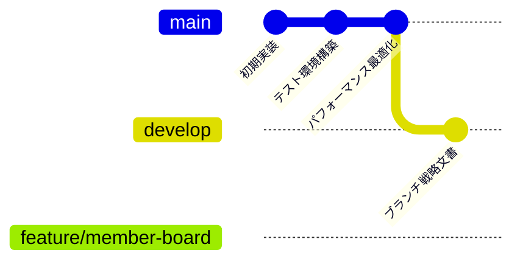

# 現在のブランチ構造

## ブランチ構造図

```
                    main (origin/main)
                     │
                     ├─── develop (origin/develop)
                     │        │
                     │        └─── [今後の機能ブランチ]
                     │
                     └─── feature/member-board ← 現在地
                              │
                              └─── [今後のサブブランチ]
```

## 詳細なブランチ関係図



## 各ブランチの説明

### 1. 🌟 **main** (本番ブランチ)
- **目的**: 本番環境にデプロイされるコード
- **状態**: 安定版のみ
- **保護**: 直接プッシュ禁止、PR必須
- **最新コミット**: `fbe78db` - パフォーマンス最適化 (Lighthouse 90+)

**特徴**:
- Vercelの本番環境に自動デプロイ
- タグでバージョン管理
- hotfixブランチの起点

### 2. 🔧 **develop** (開発統合ブランチ)
- **目的**: 各機能の統合とテスト
- **状態**: 開発中の機能を統合
- **保護**: PR必須、CIテスト必須
- **最新コミット**: `2723f5f` - Gitブランチ戦略文書

**特徴**:
- ステージング環境に自動デプロイ
- featureブランチのマージ先
- 統合テストの実施場所

### 3. 🚧 **feature/member-board** (現在の作業ブランチ)
- **目的**: 会員制掲示板機能の開発
- **状態**: 開発準備中
- **起点**: mainブランチから作成
- **現在地**: このブランチで作業中

**開発予定の機能**:
- ユーザー認証（登録・ログイン）
- 掲示板CRUD（会員限定）
- メール送信機能
- 権限管理システム

## ブランチ間の関係性

```
リリースフロー:
feature/* → develop → main

緊急修正フロー:
main → hotfix/* → main & develop
```

## 今後作成予定のブランチ

### feature/member-boardから派生予定:
```
feature/member-board
├── feature/member-board-auth      # 認証基盤
├── feature/member-board-ui        # UI実装
├── feature/member-board-api       # API実装
└── feature/member-board-db        # DB設計
```

### または個別の機能ブランチ:
```
develop
├── feature/user-auth              # ユーザー認証
├── feature/board-crud            # 掲示板CRUD
├── feature/email-notification    # メール通知
└── feature/role-permissions      # 権限管理
```

## コミット履歴の要約

### mainブランチの主要な変更:
1. **初期実装** (`e17c253`): 
   - Next.js 15 + Material-UI
   - 基本的な掲示板機能

2. **テスト環境** (`275d3ee`):
   - Jest + Playwright
   - ドキュメント追加

3. **パフォーマンス最適化** (`fbe78db`):
   - Lighthouse 90+達成
   - SSR最適化、仮想スクロール

### developブランチの追加:
4. **開発プロセス** (`2723f5f`):
   - Gitブランチ戦略
   - ブランチ保護設定

## 推奨される次のアクション

1. **feature/member-boardで開発開始**:
   ```bash
   # データベース設計から開始
   git checkout -b feature/member-board-db
   ```

2. **または、developにマージしてから個別機能**:
   ```bash
   git checkout develop
   git merge feature/member-board
   git checkout -b feature/user-auth
   ```

3. **定期的な同期**:
   ```bash
   ./scripts/sync-branch.sh
   ```

## ブランチ運用のポイント

- **main**: 常に動作する状態を保つ
- **develop**: 日々の統合作業
- **feature/***: 機能単位で小さく開発
- **定期的な同期**: コンフリクトを防ぐ