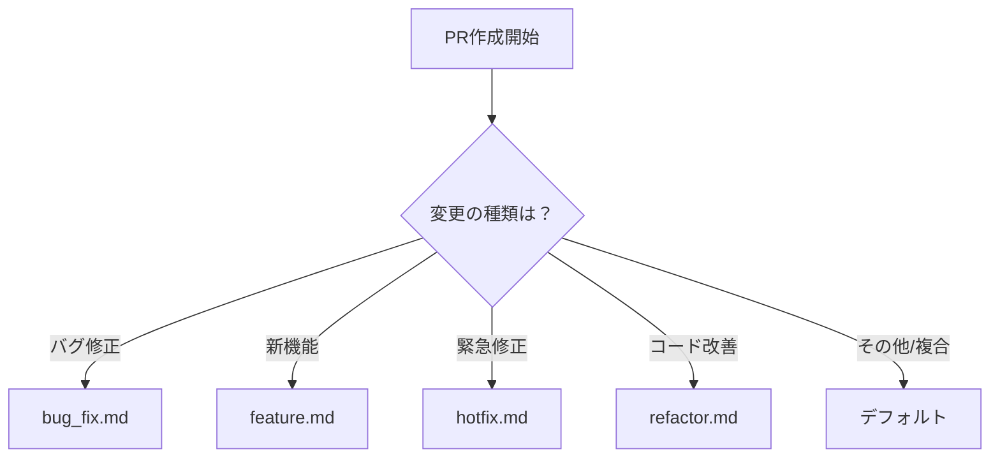

# PRテンプレート利用ガイド

## 概要

このプロジェクトでは、PRの種類に応じて複数のテンプレートを用意しています。
適切なテンプレートを使用することで、レビューの効率化と品質向上を図ります。

## テンプレートの種類

### 1. デフォルトテンプレート
**ファイル**: `.github/pull_request_template.md`
**用途**: 一般的な変更、複数の種類が混在する場合

### 2. バグ修正テンプレート
**ファイル**: `.github/PULL_REQUEST_TEMPLATE/bug_fix.md`
**用途**: バグの修正
**使用方法**: PR作成時にURLに `?template=bug_fix.md` を追加

### 3. 新機能テンプレート
**ファイル**: `.github/PULL_REQUEST_TEMPLATE/feature.md`
**用途**: 新機能の追加
**使用方法**: PR作成時にURLに `?template=feature.md` を追加

### 4. ホットフィックステンプレート
**ファイル**: `.github/PULL_REQUEST_TEMPLATE/hotfix.md`
**用途**: 本番環境の緊急修正
**使用方法**: PR作成時にURLに `?template=hotfix.md` を追加

### 5. リファクタリングテンプレート
**ファイル**: `.github/PULL_REQUEST_TEMPLATE/refactor.md`
**用途**: コードの品質改善
**使用方法**: PR作成時にURLに `?template=refactor.md` を追加

## テンプレートの選び方



## 使用例

### GitHub UIから
1. 新しいPRを作成
2. テンプレート選択ドロップダウンから適切なものを選択

### GitHub CLIから
```bash
# バグ修正PR
gh pr create --template .github/PULL_REQUEST_TEMPLATE/bug_fix.md

# 新機能PR
gh pr create --template .github/PULL_REQUEST_TEMPLATE/feature.md
```

### URLパラメータから
```
https://github.com/owner/repo/compare/main...feature-branch?template=feature.md
```

## ベストプラクティス

### 1. タイトルの付け方
- `[TYPE]` プレフィックスを使用
  - `[BUG]` - バグ修正
  - `[FEAT]` - 新機能
  - `[HOTFIX]` - 緊急修正
  - `[REFACTOR]` - リファクタリング
  - `[DOCS]` - ドキュメント
  - `[TEST]` - テスト
  - `[CHORE]` - その他

### 2. 説明の書き方
- **What**: 何を変更したか
- **Why**: なぜ変更が必要か
- **How**: どのように実装したか

### 3. スクリーンショット
- UI変更は必ず Before/After を添付
- GIFアニメーションで動作を示す
- モバイル/デスクトップ両方を確認

### 4. テスト
- 追加したテストケースを明記
- カバレッジの変化を記載
- 手動テストの手順を記載

### 5. レビューポイント
- 特に注意してほしい箇所を明記
- 設計上の判断理由を説明
- 代替案があれば記載

## チェックリストの活用

各テンプレートにはチェックリストが含まれています：

```markdown
- [ ] コードは自己レビュー済み
- [ ] 適切なコメントを追加
- [ ] 不要なconsole.logやデバッグコードを削除
```

**必ず**すべての項目を確認してからPRを提出してください。

## 自動化との連携

### GitHub Actions
- PRテンプレートのチェックリストと連動
- 必須項目が埋まっているか自動確認

### ラベル自動付与
- タイトルのプレフィックスに基づいて自動的にラベル付与
- テンプレートの種類に応じたラベル

## FAQ

### Q: テンプレートを使わずにPRを作成してしまった
A: 編集ボタンから適切なテンプレートの内容をコピー&ペーストしてください

### Q: 複数の種類の変更が含まれる場合
A: デフォルトテンプレートを使用し、各セクションで詳細を記載

### Q: テンプレートをカスタマイズしたい
A: チーム内で議論の上、該当するテンプレートファイルを編集

## 改善提案

テンプレートの改善提案は以下の方法で：
1. Issueを作成
2. DiscussionsでRFC
3. 直接PRで提案