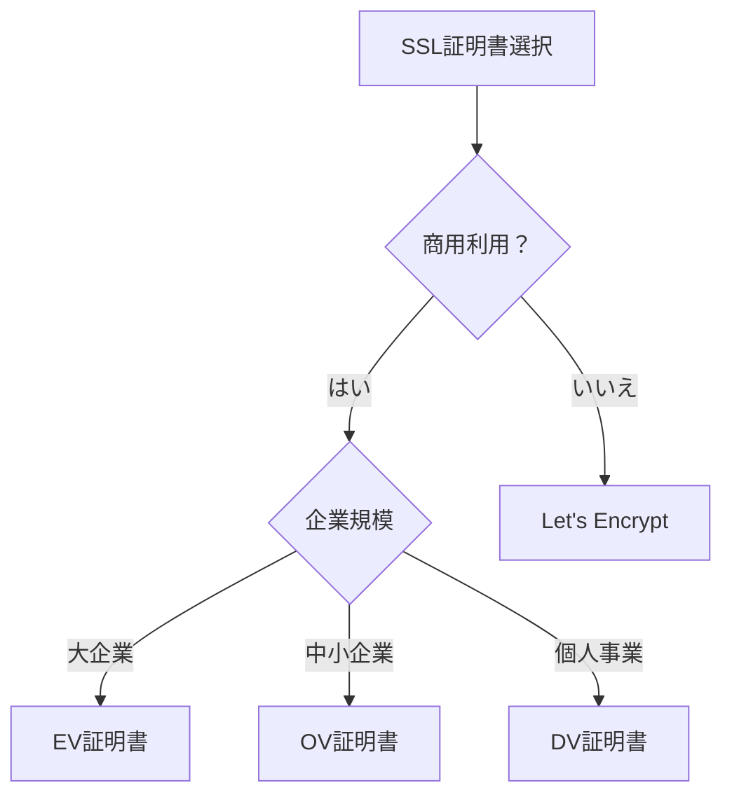

# さくらインターネット ドメイン取得チェックリスト

## 📋 事前準備チェックリスト

### ✅ 必須確認事項
- [ ] ドメイン名の最終決定（myboard.jp）
- [ ] 予算の確認（初年度＋更新費用）
- [ ] 利用するサービスの決定（レンタルサーバー、VPS等）
- [ ] メールアドレスの準備（重要な通知用）
- [ ] クレジットカードまたは銀行口座の準備

---

## 1. 📝 アカウント作成時の必要情報

### 会員登録に必要な情報
- [ ] **メールアドレス**（重要通知を受信できるもの）
- [ ] **パスワード**（英数字記号混在、12文字以上推奨）
- [ ] **氏名**（本名・ローマ字表記も準備）
- [ ] **住所**（郵便番号から正確に入力）
- [ ] **電話番号**（SMS受信可能な番号推奨）
- [ ] **生年月日**

### 法人の場合の追加情報
- [ ] **会社名**（正式名称）
- [ ] **部署名**（任意）
- [ ] **法人番号**（13桁）
- [ ] **代表者名**

### ⚠️ 注意点
```
❗ メールアドレスの重要性
- ドメイン更新通知が届く
- 重要な変更確認メールが届く
- 迷惑メールフォルダも定期確認

❗ パスワード管理
- 2要素認証の設定を推奨
- パスワードマネージャーの使用推奨
- 定期的な変更（3ヶ月ごと）

❗ 住所情報
- Whois情報に反映される可能性
- 請求書送付先として使用
- 引っ越し時は速やかに変更
```

---

## 2. 🔒 Whois情報公開代行の設定

### Whois情報公開代行とは
個人情報を保護するため、さくらインターネットの情報を代理公開するサービス

### 設定チェックリスト
- [ ] **公開代行サービスの申し込み**（無料）
- [ ] **公開される情報の確認**
  - 組織名：さくらインターネット
  - 住所：さくらインターネットの住所
  - メール：専用転送アドレス
- [ ] **転送メールアドレスの設定確認**
- [ ] **プライバシー設定の確認**

### 公開代行を使わない場合の公開情報
```
Domain Name: myboard.jp
Registrant Name: あなたの名前
Registrant Organization: 組織名（個人は空欄）
Registrant Street: あなたの住所
Registrant City: 市区町村
Registrant State/Province: 都道府県
Registrant Postal Code: 郵便番号
Registrant Country: JP
Registrant Phone: 電話番号
Registrant Email: メールアドレス
```

### ⚠️ 注意点
```
❗ 公開代行の制限
- .jpドメインは一部情報が公開される
- 商用利用時は実情報推奨の場合あり
- 転送メールの遅延可能性

❗ 設定忘れのリスク
- 個人情報が全世界に公開
- スパムメールの増加
- 営業電話の可能性

❗ 更新時の注意
- 自動更新でも設定は維持
- ドメイン移管時は再設定必要
```

---

## 3. 🌐 DNS設定の準備

### 基本DNS設定項目
- [ ] **ネームサーバーの選択**
  - [ ] さくらのネームサーバー（推奨）
  - [ ] 外部DNS（Cloudflare等）
- [ ] **Aレコードの準備**
  - ホスト名：@ または www
  - IPアドレス：サーバーのIP
- [ ] **CNAMEレコードの検討**
  - www → @
  - その他サブドメイン
- [ ] **MXレコードの設定**（メール利用時）
- [ ] **TXTレコードの準備**
  - SPF設定
  - ドメイン認証用

### Vercelを使用する場合の設定例
```
# Aレコード
@ A 76.76.21.21

# CNAMEレコード
www CNAME cname.vercel-dns.com

# TXTレコード（SPF）
@ TXT "v=spf1 include:spf.sakura.ne.jp ~all"
```

### ⚠️ 注意点
```
❗ DNS伝播時間
- 変更反映に最大48時間
- 段階的な切り替え推奨
- TTLを事前に短く設定

❗ 設定ミスの影響
- サイトが表示されない
- メールが届かない
- 速やかな修正が必要

❗ バックアップ
- 現在の設定を記録
- 変更前にスクリーンショット
- ロールバック計画の準備
```

---

## 4. 📧 メール設定の計画

### メールアドレス設計
- [ ] **運用メールアドレスの決定**
  ```
  info@myboard.jp      - 総合窓口
  support@myboard.jp   - サポート
  admin@myboard.jp     - 管理者
  noreply@myboard.jp   - 送信専用
  ```
- [ ] **メールサーバーの選択**
  - [ ] さくらのメールボックス
  - [ ] Google Workspace
  - [ ] Microsoft 365
  - [ ] 外部メールサービス

### メールセキュリティ設定
- [ ] **SPFレコード設定**
  ```
  TXT "v=spf1 include:spf.sakura.ne.jp ~all"
  ```
- [ ] **DKIM設定**（対応サービス利用時）
- [ ] **DMARC設定**（推奨）
  ```
  _dmarc TXT "v=DMARC1; p=none; rua=mailto:admin@myboard.jp"
  ```

### ⚠️ 注意点
```
❗ メールアドレスの重要性
- info@は必須（ビジネス信頼性）
- スパム対策の実装必須
- 定期的なメンテナンス

❗ 移行時の注意
- 既存メールのバックアップ
- 並行運用期間の設定
- クライアント設定の更新

❗ 容量制限
- さくら：10GB/アカウント
- 定期的な整理必要
- アーカイブルールの設定
```

---

## 5. 🔐 SSL証明書の検討

### SSL証明書の種類と選択
- [ ] **Let's Encrypt**（無料）
  - 自動更新対応
  - 90日有効期限
  - 個人・小規模向け
- [ ] **さくらのSSL**
  - [ ] ドメイン認証（DV）：年額990円〜
  - [ ] 企業認証（OV）：年額49,500円〜
  - [ ] EV認証：年額99,000円〜
- [ ] **外部SSL**（Cloudflare等）

### SSL証明書選択フローチャート


### 設定準備チェック
- [ ] **CSR（証明書署名要求）の生成準備**
- [ ] **承認メールアドレスの確認**
  - admin@myboard.jp
  - webmaster@myboard.jp
- [ ] **企業情報の準備**（OV/EV証明書の場合）
- [ ] **自動更新の設定確認**

### ⚠️ 注意点
```
❗ Let's Encryptの制限
- ワイルドカード証明書対応
- 更新忘れに注意（自動化推奨）
- レート制限あり

❗ 有料証明書のメリット
- 保証額あり
- サポート充実
- 企業の信頼性向上

❗ 更新管理
- 有効期限の60日前通知設定
- 自動更新の動作確認
- 予備の更新手段確保
```

---

## 📅 ドメイン取得後のアクションリスト

### 即日実施
- [ ] DNS設定の実施
- [ ] Whois情報の確認
- [ ] 管理画面へのログイン確認
- [ ] 2要素認証の設定

### 1週間以内
- [ ] メールアドレスの作成
- [ ] SSL証明書の申請・設定
- [ ] バックアップ体制の確立
- [ ] 監視システムの設定

### 1ヶ月以内
- [ ] ドメイン更新設定の確認
- [ ] セキュリティ監査
- [ ] ドキュメント整備
- [ ] 緊急時対応計画の策定

---

## 💰 費用計算シート

### 初年度費用
```
ドメイン登録（.jp）     : 3,300円
Whois情報公開代行       : 0円
SSL証明書（Let's）      : 0円
--------------------------------
初年度合計              : 3,300円
```

### 2年目以降（年間）
```
ドメイン更新（.jp）     : 3,960円
Whois情報公開代行       : 0円
SSL証明書（Let's）      : 0円
--------------------------------
年間合計                : 3,960円
```

### オプション費用
```
有料SSL（DV）           : 990円/年
メールボックス追加      : 1,100円/年
DNS運用代行             : 要見積
```

---

## 🚨 緊急時対応

### ドメイン失効時
1. さくらインターネットサポートに即連絡
2. 猶予期間内（30日）に更新
3. 復旧手数料の支払い（必要な場合）

### アカウント乗っ取り時
1. パスワード即変更
2. 2要素認証の再設定
3. サポートへ報告
4. ドメインロックの申請

### 連絡先
- さくらインターネットサポート
  - TEL: 06-6476-8790
  - 営業時間: 平日10:00-18:00
  - メール: support@sakura.ad.jp

---

## ✅ 最終確認チェックリスト

- [ ] すべての必要情報を準備した
- [ ] 予算を確保した
- [ ] バックアップ計画を立てた
- [ ] 緊急連絡先を控えた
- [ ] ドメイン名を最終確認した（スペルミスなし）

**準備完了後、さくらインターネットでドメイン取得を開始してください！**