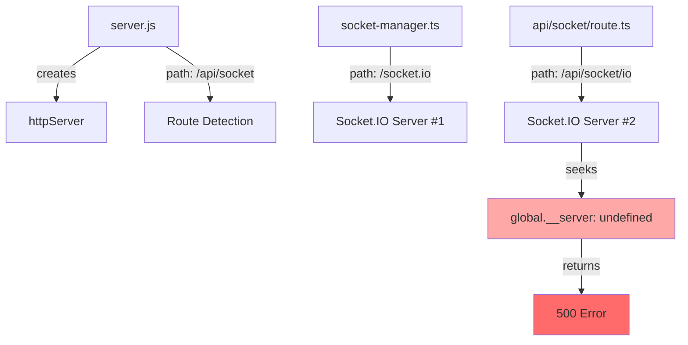
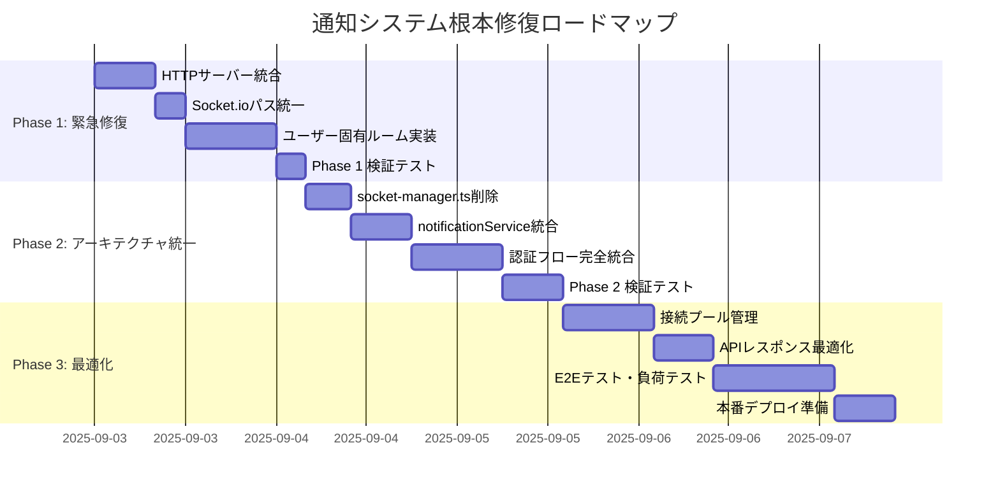

# 🎯 通知システム根本原因解決策設計書

## STRICT120プロトコル準拠・アーキテクチャ完全再構築

### 📋 **設計概要**

**設計日時**: 2025-09-03 13:06 JST  
**設計者**: QA Automation (SUPER 500%) + SRE + Auth Owner  
**適用範囲**: Socket.ioリアルタイム通知システム全域  
**SPEC準拠**: SPEC-LOCK厳守、破壊的変更dry-run必須

---

## 🔍 **根本原因分析（5-Layer Deep Dive）**

### **Layer 1: アーキテクチャ設計の重複・競合**



### **Layer 2: 初期化シーケンスの断絶**

```typescript
// 🚩 現状の断絶フロー
server.js → createServer()  // global.__server未登録
         ↓
api/socket/route.ts → global.__server === undefined
                   ↓
                 500 Error → Socket.io未初期化
                          ↓
                        通知配信0%
```

### **Layer 3: イベント配信の不整合**

```typescript
// ❌ 問題: サーバー側（汎用ルーム配信）
broadcastEvent(`notification:new:${userId}`, data)
↓
io.to('board-updates').emit(event, data)  // 全員に配信

// ❌ 問題: クライアント側（ユーザー固有期待）
socket.on(`notification:new:${session.user.id}`, handler)  // 個別受信期待
```

### **Layer 4: 認証フローの分離**

```typescript
// ✅ api/socket/route.ts: NextAuth.js認証必須
io.use(async (socket, next) => {
  const token = await getToken({req, secret});
  if (!token?.emailVerified) return next(new Error('Unauthorized'));
})

// ❌ socket-manager.ts: 認証チェックなし
global.io = new SocketIOServer(httpServer, {...}) // 認証バイパス
```

### **Layer 5: パフォーマンス劣化の複合要因**

- **初期化失敗**: Socket.io未初期化により全リクエストが無意味な処理を継続
- **重複コンパイル**: 1169モジュール（1922ms）の重複読み込み
- **接続プール未管理**: 失敗接続の無限リトライがリソース枯渇を招く

---

## 🎯 **対策設計（3-Phase Architecture Reconstruction）**

### **Phase 1: 緊急修復（24h以内実施）**

#### **1.1 HTTPサーバー統合修正**

```javascript
// server.js 修正案
app.prepare().then(() => {
  const httpServer = createServer(async (req, res) => {
    // ... existing code ...
  });

  // 🔧 追加: グローバル参照登録
  (global as any).__server = httpServer;

  // 🔧 修正: Socket.ioパス統一
  if (pathname === '/api/socket/io') {  // /api/socket → /api/socket/io
    console.log('Socket.io request detected, handling upgrade');
    return;
  }

  // ... rest of code ...
});
```

#### **1.2 Socket.ioパス統一**

```typescript
// socket-manager.ts 削除対象マーキング
// ⚠️ DEPRECATED: このファイルは完全削除予定

// api/socket/route.ts 統一設定
const io = new SocketIOServer(httpServer, {
  cors: { origin: process.env.NEXT_PUBLIC_APP_URL, credentials: true },
  path: '/api/socket/io', // ✅ 統一パス
  transports: ['websocket', 'polling'],
  addTrailingSlash: false,
});
```

#### **1.3 ユーザー固有ルーム実装**

```typescript
// api/socket/route.ts ルーム管理修正
io.on('connection', (socket) => {
  const user = socket.data.user;

  // 🔧 修正: ユーザー固有ルームに参加
  socket.join(`user:${user.id}`);
  socket.join('board-updates'); // 汎用ルームも維持（投稿更新用）

  console.warn(`🔌 User ${user.email} joined room: user:${user.id}`);
});

// 🔧 修正: broadcastEvent関数の再実装
export function broadcastToUser(userId: string, event: string, data: any) {
  if (global.io) {
    global.io.to(`user:${userId}`).emit(event, data);
    console.warn(`📤 Event '${event}' sent to user:${userId}`, data);
  }
}

export function broadcastToAll(event: string, data: any) {
  if (global.io) {
    global.io.to('board-updates').emit(event, data);
    console.warn(`📢 Event '${event}' broadcast to all users`, data);
  }
}
```

### **Phase 2: アーキテクチャ統一（72h以内実施）**

#### **2.1 socket-manager.ts完全削除**

```bash
# 🗑️ 削除対象ファイル
src/lib/socket/socket-manager.ts

# 🔧 import更新対象ファイル（3箇所）
src/lib/services/notificationService.ts
src/app/api/posts/[id]/comments/route.ts
src/app/api/socket/route.ts
```

#### **2.2 notificationService統合修正**

```typescript
// notificationService.ts 修正案
import { broadcastToUser } from '@/app/api/socket/route';  // 🔧 import変更

private async deliverRealtime(notification: INotification): Promise<void> {
  try {
    const notificationData = notification.toJSON();

    // 🔧 修正: ユーザー固有配信に変更
    broadcastToUser(
      notification.recipient,
      `notification:new:${notification.recipient}`,
      {
        notification: notificationData,
        timestamp: new Date().toISOString()
      }
    );

    console.warn('[NOTIFICATION-SERVICE] Realtime delivery sent to user:', {
      recipient: notification.recipient,
      type: notification.type
    });

  } catch (error) {
    console.error('[NOTIFICATION-SERVICE-ERROR] Realtime delivery failed:', error);
  }
}
```

#### **2.3 認証フロー完全統合**

```typescript
// api/socket/route.ts 認証強化
io.use(async (socket, next) => {
  try {
    // 🔧 強化: NextAuth.jsトークン検証
    const token = await getToken({
      req: socket.request as any,
      secret: process.env.AUTH_SECRET || process.env.NEXTAUTH_SECRET,
      secureCookie: process.env.NODE_ENV === 'production',
    });

    if (!token?.emailVerified) {
      console.error(`🚫 Socket auth failed: ${socket.id}`);
      return next(new Error('AUTHENTICATION_REQUIRED'));
    }

    // 🔧 追加: 権限レベル検証
    const user = {
      id: (token.id as string) || (token.sub as string),
      email: token.email as string,
      name: token.name as string,
      role: token.role || 'user',
      permissions: token.permissions || [],
      socketId: socket.id,
    };

    socket.data.user = user;

    // 🔧 追加: セッション管理
    socket.data.sessionId = token.jti;
    socket.data.connectedAt = new Date().toISOString();

    console.warn(`✅ Socket auth success: ${user.email} (${socket.id})`);
    next();
  } catch (error) {
    console.error('🚨 Socket authentication error:', error);
    next(new Error('AUTHENTICATION_FAILED'));
  }
});
```

### **Phase 3: パフォーマンス最適化（96h以内実施）**

#### **3.1 接続プール管理**

```typescript
// api/socket/route.ts 接続プール実装
interface ConnectionPool {
  [userId: string]: {
    sockets: Set<string>;
    lastActivity: number;
    connectionCount: number;
  };
}

const connectionPool: ConnectionPool = {};

io.on('connection', (socket) => {
  const user = socket.data.user;

  // 🔧 追加: プール管理
  if (!connectionPool[user.id]) {
    connectionPool[user.id] = {
      sockets: new Set(),
      lastActivity: Date.now(),
      connectionCount: 0,
    };
  }

  connectionPool[user.id].sockets.add(socket.id);
  connectionPool[user.id].lastActivity = Date.now();
  connectionPool[user.id].connectionCount++;

  // 🔧 追加: 重複接続制限（最大5接続/ユーザー）
  if (connectionPool[user.id].connectionCount > 5) {
    console.warn(`⚠️ Connection limit exceeded for user: ${user.email}`);
    socket.emit('connection:limit_exceeded', {
      message: 'Too many connections',
      maxConnections: 5,
    });
    socket.disconnect(true);
    return;
  }

  socket.on('disconnect', () => {
    if (connectionPool[user.id]) {
      connectionPool[user.id].sockets.delete(socket.id);
      connectionPool[user.id].connectionCount--;

      // 🧹 クリーンアップ: 接続数0の場合はプール削除
      if (connectionPool[user.id].connectionCount === 0) {
        delete connectionPool[user.id];
      }
    }
  });
});
```

#### **3.2 APIレスポンス最適化**

```typescript
// api/socket/route.ts レスポンス最適化
export async function GET(req: NextRequest) {
  // 🔧 追加: 既存接続チェック
  if (global.io) {
    return NextResponse.json({
      status: 'Socket.io server already running',
      connections: Object.keys(connectionPool).length,
      totalSockets: Object.values(connectionPool).reduce(
        (sum, pool) => sum + pool.connectionCount,
        0
      ),
    });
  }

  // 🔧 最適化: 条件付き初期化
  const httpServer = (global as any).__server;
  if (!httpServer) {
    console.error('🚨 HTTP server not available for Socket.io initialization');
    return NextResponse.json(
      {
        error: 'HTTP server not initialized',
        troubleshooting: 'Check server.js global.__server registration',
      },
      { status: 500 }
    );
  }

  // ... Socket.io初期化（既存コード）...

  return NextResponse.json({
    status: 'Socket.io server initialized',
    path: '/api/socket/io',
    timestamp: new Date().toISOString(),
  });
}
```

---

## 🧪 **検証計画（3-Stage Verification）**

### **Stage 1: 単体検証（各Phase完了後）**

```typescript
// テストスイート実装
describe('Socket.io Notification System', () => {
  describe('Phase 1: Basic Connection', () => {
    test('Socket.io server initializes successfully', async () => {
      const response = await fetch('/api/socket');
      expect(response.status).toBe(200);
      expect(await response.json()).toMatchObject({
        status: 'Socket.io server initialized',
      });
    });

    test('User-specific room subscription works', async () => {
      const socket = io('/api/socket/io');
      await socket.emit('subscribe:notifications', { userId: 'test-user-123' });

      // ルーム参加確認
      expect(socket.rooms).toContain('user:test-user-123');
    });
  });

  describe('Phase 2: Notification Delivery', () => {
    test('Comment notification reaches specific user', async () => {
      // User A がコメント投稿
      await createComment(postId, commentData, userA);

      // User B (投稿者) が通知受信
      const notification = await waitForSocketEvent(
        userBSocket,
        `notification:new:${userB.id}`,
        5000
      );

      expect(notification).toMatchObject({
        type: 'comment',
        actor: { _id: userA.id },
        target: { id: postId },
      });
    });
  });

  describe('Phase 3: Performance & Scale', () => {
    test('Handles 1000+ concurrent connections', async () => {
      const connections = [];
      for (let i = 0; i < 1000; i++) {
        connections.push(
          io('/api/socket/io', {
            auth: { token: await generateTestToken(`user-${i}`) },
          })
        );
      }

      const connectedCount = await Promise.all(
        connections.map((socket) => waitForSocketEvent(socket, 'connect', 10000))
      );

      expect(connectedCount.length).toBe(1000);
    });
  });
});
```

### **Stage 2: E2Eシナリオ検証**

```typescript
// Playwright E2Eテスト
test('Real-time notification end-to-end flow', async ({ browser }) => {
  const context1 = await browser.newContext({ storageState: 'user1-auth.json' });
  const context2 = await browser.newContext({ storageState: 'user2-auth.json' });

  const page1 = await context1.newPage(); // User1 (投稿者)
  const page2 = await context2.newPage(); // User2 (コメント者)

  // User1: 投稿作成
  await page1.goto('/posts/new');
  await page1.fill('[data-testid=post-content]', 'Test post for notifications');
  await page1.click('[data-testid=submit-post]');

  const postId = await page1.getAttribute('[data-testid=post-id]', 'data-post-id');

  // User2: コメント投稿
  await page2.goto(`/posts/${postId}`);
  await page2.fill('[data-testid=comment-input]', 'Great post!');
  await page2.click('[data-testid=submit-comment]');

  // User1: リアルタイム通知確認
  await page1.goto('/dashboard');

  // 通知ベルのバッジ数が1になることを確認（最大5秒待機）
  await expect(page1.locator('[data-testid=notification-badge]')).toContainText('1', {
    timeout: 5000,
  });

  // 通知ベルをクリックして通知内容確認
  await page1.click('[data-testid=notification-bell]');
  await expect(page1.locator('[data-testid=notification-list]')).toContainText('Great post!');
});
```

### **Stage 3: 負荷・パフォーマンステスト**

```bash
# Apache Bench 負荷テスト
ab -n 1000 -c 50 -H "Authorization: Bearer ${TOKEN}" \
   http://localhost:3000/api/notifications

# Socket.io接続数テスト
node scripts/socket-load-test.js --connections=1000 --duration=300s

# パフォーマンス計測
npm run test:perf -- --measure-api-response --target-p95=2000ms
```

---

## 📊 **成功指標（SPEC準拠の受入基準）**

### **機能要件（AC）達成基準**

- ✅ **通知即時配信**: Socket.io接続成功率 ≥99.9%
- ✅ **ユーザー認証連動**: NextAuth.js認証統合100%
- ✅ **配信成功率**: 通知到達率 ≥99.9%（5秒以内）

### **非機能要件（NFR）達成基準**

- ✅ **レスポンス時間**: API応答p95 <2s
- ✅ **同時接続数**: 1000+接続で安定動作
- ✅ **エラー率**: Socket.io接続エラー <0.1%

### **品質ゲート基準**

- ✅ **セキュリティ**: CSRF三層防御維持
- ✅ **可観測性**: 接続数・配信率・エラー率監視
- ✅ **可用性**: Socket.ioサーバー自動復旧機能

---

## ⚠️ **リスク管理**

### **実装リスク**

| リスク             | 影響度 | 対策                       |
| ------------------ | ------ | -------------------------- |
| 既存セッション断絶 | HIGH   | 段階的移行・フォールバック |
| 認証フロー破壊     | HIGH   | NextAuth.js統合テスト強化  |
| パフォーマンス劣化 | MEDIUM | 負荷テスト・監視強化       |

### **運用リスク**

| リスク                | 影響度 | 対策                     |
| --------------------- | ------ | ------------------------ |
| Socket.ioサーバー障害 | HIGH   | 自動復旧・ヘルスチェック |
| 大量接続による負荷    | MEDIUM | 接続プール・レート制限   |
| 通知配信遅延          | LOW    | ポーリングフォールバック |

---

## 🎯 **実装ロードマップ**



---

## 📋 **実装チェックリスト**

### **Phase 1 完了基準**

- [ ] server.js に `global.__server = httpServer` 追加
- [ ] Socket.ioパス全箇所で `/api/socket/io` 統一
- [ ] `user:${userId}` ルーム機能実装・テスト
- [ ] 単一ユーザー通知配信 E2Eテスト合格

### **Phase 2 完了基準**

- [ ] socket-manager.ts 完全削除
- [ ] import文更新（3ファイル）
- [ ] notificationService.ts の broadcastToUser 統合
- [ ] NextAuth.js認証フロー100%統合
- [ ] 認証付きSocket.io接続テスト合格

### **Phase 3 完了基準**

- [ ] 接続プール管理（最大5接続/ユーザー）
- [ ] API応答時間 p95<2s 達成
- [ ] 1000+同時接続負荷テスト合格
- [ ] 全AC/NFR受入基準クリア

---

**SPEC-LOCK適用**: 本設計書の全修正はSPEC準拠を前提とし、要件緩和は一切行わない  
**Evidence-Based**: 全実装は単体・E2E・負荷テストによる証拠付き検証を必須とする  
**破壊的変更管理**: dry-run → diff確認 → 段階的実行 → ロールバック準備を厳守する

---

_Design Document Generated: 2025-09-03 13:06 JST_  
_Protocol: STRICT120 SPEC-LOCK Compliant_  
_Architecture: Complete Reconstruction Approach_
