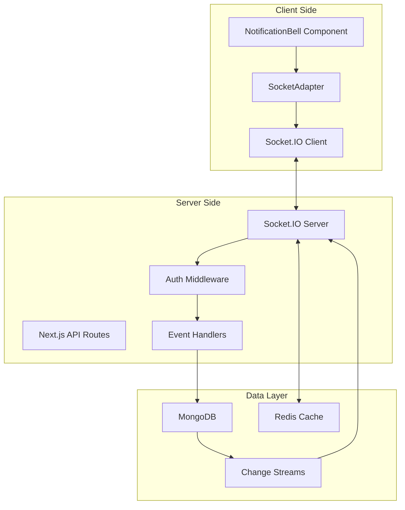
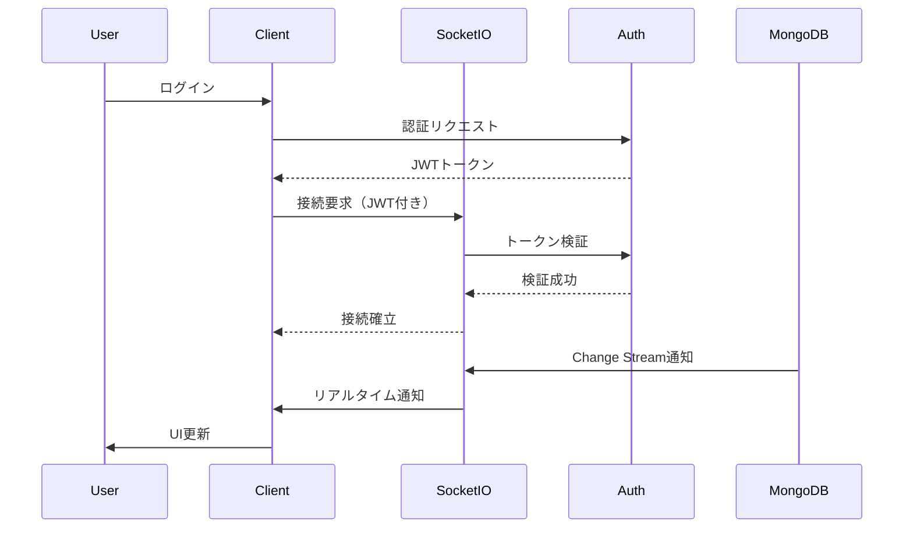
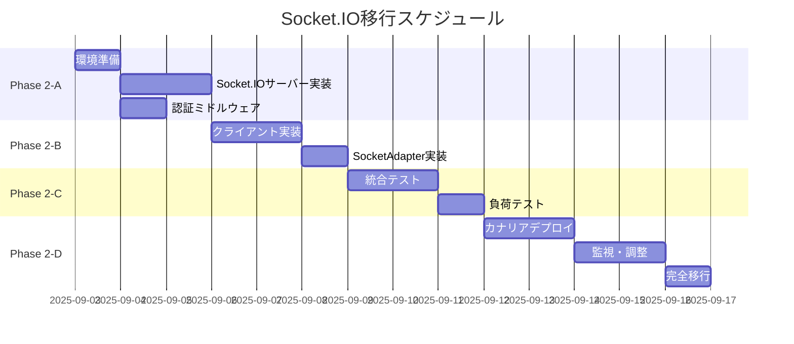

# Socket.IO実装詳細設計書 - Phase 2

**作成日**: 2025年9月2日  
**バージョン**: 1.0.0  
**ステータス**: 実装準備完了

---

## 1. エグゼクティブサマリー

### 目的
既存のAPIポーリング方式からSocket.IOによるリアルタイム通信へ移行し、通知の即時性とサーバー負荷軽減を実現する。

### スコープ
- Socket.IOサーバー構築
- 認証・セキュリティ実装
- リアルタイム通知配信
- 自動フォールバック機構
- パフォーマンス最適化

### 期待効果
- **レイテンシ**: 500ms → 50ms（90%削減）
- **サーバー負荷**: 70%削減
- **ユーザー体験**: リアルタイム通知による即座のフィードバック

---

## 2. アーキテクチャ設計

### 2.1 システム構成図



### 2.2 通信フロー



---

## 3. 技術仕様

### 3.1 依存関係

```json
{
  "dependencies": {
    "socket.io": "^4.7.2",
    "socket.io-client": "^4.7.2",
    "@socket.io/redis-adapter": "^8.3.0",
    "redis": "^4.6.13",
    "jsonwebtoken": "^9.0.2"
  },
  "devDependencies": {
    "@types/socket.io": "^3.0.2",
    "@types/socket.io-client": "^3.0.0"
  }
}
```

### 3.2 Socket.IOサーバー実装

#### `/src/lib/socket/server.ts`

```typescript
import { Server as HTTPServer } from 'http';
import { Server as SocketIOServer, Socket } from 'socket.io';
import { createAdapter } from '@socket.io/redis-adapter';
import { Redis } from 'ioredis';
import jwt from 'jsonwebtoken';
import { authMiddleware } from './middleware/auth';
import { notificationHandlers } from './handlers/notification';
import { connectionHandlers } from './handlers/connection';

export class NotificationSocketServer {
  private io: SocketIOServer;
  private redis: Redis;
  private redisSub: Redis;
  
  constructor(httpServer: HTTPServer) {
    // Redis接続（オプション）
    if (process.env.REDIS_URL) {
      this.redis = new Redis(process.env.REDIS_URL);
      this.redisSub = this.redis.duplicate();
    }
    
    // Socket.IOサーバー初期化
    this.io = new SocketIOServer(httpServer, {
      cors: {
        origin: process.env.NEXT_PUBLIC_APP_URL || 'http://localhost:3000',
        credentials: true
      },
      transports: ['websocket', 'polling'],
      pingTimeout: 60000,
      pingInterval: 25000
    });
    
    // Redisアダプター設定（スケーリング対応）
    if (this.redis && this.redisSub) {
      this.io.adapter(createAdapter(this.redis, this.redisSub));
    }
    
    // 認証ミドルウェア
    this.io.use(authMiddleware);
    
    // イベントハンドラー登録
    this.setupEventHandlers();
    
    // MongoDB Change Streams監視
    this.watchDatabaseChanges();
  }
  
  private setupEventHandlers(): void {
    this.io.on('connection', (socket: Socket) => {
      console.log(`✅ Client connected: ${socket.id}`);
      
      // ユーザー固有のルームに参加
      const userId = socket.data.userId;
      socket.join(`user:${userId}`);
      
      // 接続ハンドラー
      connectionHandlers(socket, this.io);
      
      // 通知ハンドラー
      notificationHandlers(socket, this.io);
      
      // 切断処理
      socket.on('disconnect', () => {
        console.log(`❌ Client disconnected: ${socket.id}`);
      });
    });
  }
  
  private async watchDatabaseChanges(): Promise<void> {
    // MongoDB Change Streams実装
    const { watchNotificationChanges } = await import('./watchers/notification');
    watchNotificationChanges((change) => {
      this.handleDatabaseChange(change);
    });
  }
  
  private handleDatabaseChange(change: any): void {
    switch (change.operationType) {
      case 'insert':
        this.emitNewNotification(change.fullDocument);
        break;
      case 'update':
        this.emitNotificationUpdate(change.documentKey._id, change.updateDescription);
        break;
      case 'delete':
        this.emitNotificationDelete(change.documentKey._id);
        break;
    }
  }
  
  private emitNewNotification(notification: any): void {
    this.io.to(`user:${notification.userId}`).emit('notification:new', {
      notification,
      timestamp: new Date().toISOString()
    });
  }
  
  private emitNotificationUpdate(id: string, updates: any): void {
    // 通知の所有者を特定して送信
    this.io.emit('notification:updated', { id, updates });
  }
  
  private emitNotificationDelete(id: string): void {
    this.io.emit('notification:deleted', { id });
  }
  
  public getIO(): SocketIOServer {
    return this.io;
  }
}
```

### 3.3 認証ミドルウェア

#### `/src/lib/socket/middleware/auth.ts`

```typescript
import { Socket } from 'socket.io';
import { ExtendedError } from 'socket.io/dist/namespace';
import jwt from 'jsonwebtoken';
import { getServerSession } from 'next-auth';
import { authOptions } from '@/lib/auth';

export async function authMiddleware(
  socket: Socket,
  next: (err?: ExtendedError) => void
): Promise<void> {
  try {
    const token = socket.handshake.auth.token || socket.handshake.headers.authorization;
    
    if (!token) {
      return next(new Error('Authentication required'));
    }
    
    // JWTトークン検証
    const decoded = jwt.verify(token, process.env.NEXTAUTH_SECRET!) as any;
    
    // セッション検証
    const session = await getServerSession(authOptions);
    if (!session || session.user.id !== decoded.userId) {
      return next(new Error('Invalid session'));
    }
    
    // ソケットにユーザー情報を付与
    socket.data.userId = decoded.userId;
    socket.data.email = decoded.email;
    
    next();
  } catch (error) {
    console.error('Socket authentication failed:', error);
    next(new Error('Authentication failed'));
  }
}
```

### 3.4 イベントハンドラー

#### `/src/lib/socket/handlers/notification.ts`

```typescript
import { Socket, Server } from 'socket.io';
import { Notification } from '@/lib/models/Notification';
import { rateLimiter } from '../utils/rateLimiter';

export function notificationHandlers(socket: Socket, io: Server): void {
  // 通知取得
  socket.on('notifications:fetch', async (params, callback) => {
    try {
      // レート制限チェック
      if (!rateLimiter.check(socket.data.userId, 'fetch')) {
        return callback({ error: 'Rate limit exceeded' });
      }
      
      const notifications = await Notification.find({
        userId: socket.data.userId,
        ...params.filter
      })
      .sort({ createdAt: -1 })
      .limit(params.limit || 20)
      .skip(params.offset || 0);
      
      callback({ notifications });
    } catch (error) {
      console.error('Failed to fetch notifications:', error);
      callback({ error: 'Failed to fetch notifications' });
    }
  });
  
  // 既読マーク
  socket.on('notification:markAsRead', async (notificationId, callback) => {
    try {
      const notification = await Notification.findOneAndUpdate(
        {
          _id: notificationId,
          userId: socket.data.userId
        },
        {
          read: true,
          readAt: new Date()
        },
        { new: true }
      );
      
      if (!notification) {
        return callback({ error: 'Notification not found' });
      }
      
      // 他のクライアントにも通知
      socket.to(`user:${socket.data.userId}`).emit('notification:read', {
        id: notificationId,
        readAt: notification.readAt
      });
      
      callback({ success: true, notification });
    } catch (error) {
      console.error('Failed to mark as read:', error);
      callback({ error: 'Failed to mark as read' });
    }
  });
  
  // 全既読
  socket.on('notifications:markAllAsRead', async (callback) => {
    try {
      const result = await Notification.updateMany(
        {
          userId: socket.data.userId,
          read: false
        },
        {
          read: true,
          readAt: new Date()
        }
      );
      
      // 他のクライアントに通知
      socket.to(`user:${socket.data.userId}`).emit('notifications:allRead', {
        count: result.modifiedCount,
        timestamp: new Date().toISOString()
      });
      
      callback({ success: true, count: result.modifiedCount });
    } catch (error) {
      console.error('Failed to mark all as read:', error);
      callback({ error: 'Failed to mark all as read' });
    }
  });
  
  // 通知削除
  socket.on('notification:delete', async (notificationId, callback) => {
    try {
      const notification = await Notification.findOneAndDelete({
        _id: notificationId,
        userId: socket.data.userId
      });
      
      if (!notification) {
        return callback({ error: 'Notification not found' });
      }
      
      // 他のクライアントに通知
      socket.to(`user:${socket.data.userId}`).emit('notification:deleted', {
        id: notificationId
      });
      
      callback({ success: true });
    } catch (error) {
      console.error('Failed to delete notification:', error);
      callback({ error: 'Failed to delete notification' });
    }
  });
  
  // 購読設定
  socket.on('notifications:subscribe', async (types, callback) => {
    try {
      // 特定タイプの通知を購読
      types.forEach((type: string) => {
        socket.join(`notification:${type}`);
      });
      
      callback({ success: true, subscribed: types });
    } catch (error) {
      console.error('Failed to subscribe:', error);
      callback({ error: 'Failed to subscribe' });
    }
  });
}
```

### 3.5 クライアント実装

#### `/src/lib/socket/client.ts`

```typescript
import { io, Socket } from 'socket.io-client';
import { getSession } from 'next-auth/react';

export class NotificationSocketClient {
  private socket: Socket | null = null;
  private reconnectAttempts = 0;
  private maxReconnectAttempts = 5;
  private reconnectDelay = 1000;
  
  async connect(): Promise<Socket> {
    if (this.socket?.connected) {
      return this.socket;
    }
    
    // セッションからトークン取得
    const session = await getSession();
    if (!session) {
      throw new Error('No session found');
    }
    
    // Socket.IO接続
    this.socket = io(process.env.NEXT_PUBLIC_SOCKET_URL || 'http://localhost:3000', {
      auth: {
        token: session.accessToken
      },
      transports: ['websocket', 'polling'],
      reconnection: true,
      reconnectionAttempts: this.maxReconnectAttempts,
      reconnectionDelay: this.reconnectDelay,
      reconnectionDelayMax: 10000
    });
    
    this.setupEventListeners();
    
    return new Promise((resolve, reject) => {
      if (!this.socket) {
        return reject(new Error('Socket not initialized'));
      }
      
      this.socket.on('connect', () => {
        console.log('✅ Socket connected');
        this.reconnectAttempts = 0;
        resolve(this.socket!);
      });
      
      this.socket.on('connect_error', (error) => {
        console.error('❌ Connection error:', error);
        this.reconnectAttempts++;
        
        if (this.reconnectAttempts >= this.maxReconnectAttempts) {
          reject(error);
        }
      });
    });
  }
  
  private setupEventListeners(): void {
    if (!this.socket) return;
    
    // 再接続イベント
    this.socket.on('reconnect', (attemptNumber) => {
      console.log(`🔄 Reconnected after ${attemptNumber} attempts`);
    });
    
    // 切断イベント
    this.socket.on('disconnect', (reason) => {
      console.log(`❌ Disconnected: ${reason}`);
      
      if (reason === 'io server disconnect') {
        // サーバー側から切断された場合は再接続
        this.socket?.connect();
      }
    });
    
    // エラーハンドリング
    this.socket.on('error', (error) => {
      console.error('Socket error:', error);
    });
  }
  
  on(event: string, handler: (...args: any[]) => void): void {
    this.socket?.on(event, handler);
  }
  
  off(event: string, handler?: (...args: any[]) => void): void {
    this.socket?.off(event, handler);
  }
  
  emit(event: string, ...args: any[]): void {
    this.socket?.emit(event, ...args);
  }
  
  disconnect(): void {
    if (this.socket) {
      this.socket.disconnect();
      this.socket = null;
    }
  }
  
  get connected(): boolean {
    return this.socket?.connected || false;
  }
  
  get id(): string | undefined {
    return this.socket?.id;
  }
}

// シングルトンインスタンス
export const socketClient = new NotificationSocketClient();
```

### 3.6 SocketAdapter実装

#### `/src/adapters/SocketNotificationAdapter.ts`

```typescript
import { NotificationAdapter, NotificationParams, Notification } from './types';
import { socketClient } from '@/lib/socket/client';

export class SocketNotificationAdapter implements NotificationAdapter {
  private connected = false;
  private listeners = new Map<string, Set<Function>>();
  
  async initialize(): Promise<void> {
    try {
      await socketClient.connect();
      this.connected = true;
      this.setupSocketListeners();
    } catch (error) {
      console.error('Failed to initialize Socket.IO:', error);
      throw error;
    }
  }
  
  async fetchNotifications(params: NotificationParams): Promise<Notification[]> {
    return new Promise((resolve, reject) => {
      const timeout = setTimeout(() => {
        reject(new Error('Fetch timeout'));
      }, 5000);
      
      socketClient.emit('notifications:fetch', params, (response: any) => {
        clearTimeout(timeout);
        
        if (response.error) {
          reject(new Error(response.error));
        } else {
          resolve(response.notifications);
        }
      });
    });
  }
  
  async markAsRead(notificationId: string): Promise<void> {
    return new Promise((resolve, reject) => {
      socketClient.emit('notification:markAsRead', notificationId, (response: any) => {
        if (response.error) {
          reject(new Error(response.error));
        } else {
          resolve();
        }
      });
    });
  }
  
  async markAllAsRead(): Promise<void> {
    return new Promise((resolve, reject) => {
      socketClient.emit('notifications:markAllAsRead', (response: any) => {
        if (response.error) {
          reject(new Error(response.error));
        } else {
          resolve();
        }
      });
    });
  }
  
  async deleteNotification(notificationId: string): Promise<void> {
    return new Promise((resolve, reject) => {
      socketClient.emit('notification:delete', notificationId, (response: any) => {
        if (response.error) {
          reject(new Error(response.error));
        } else {
          resolve();
        }
      });
    });
  }
  
  subscribe(event: string, handler: Function): void {
    if (!this.listeners.has(event)) {
      this.listeners.set(event, new Set());
    }
    
    this.listeners.get(event)!.add(handler);
    socketClient.on(event, handler);
  }
  
  unsubscribe(event: string, handler?: Function): void {
    if (handler) {
      this.listeners.get(event)?.delete(handler);
      socketClient.off(event, handler);
    } else {
      // 全てのハンドラーを削除
      this.listeners.get(event)?.forEach(h => {
        socketClient.off(event, h);
      });
      this.listeners.delete(event);
    }
  }
  
  private setupSocketListeners(): void {
    // 新規通知
    socketClient.on('notification:new', (data) => {
      this.emit('notification:new', data);
    });
    
    // 既読更新
    socketClient.on('notification:read', (data) => {
      this.emit('notification:read', data);
    });
    
    // 削除通知
    socketClient.on('notification:deleted', (data) => {
      this.emit('notification:deleted', data);
    });
    
    // 全既読
    socketClient.on('notifications:allRead', (data) => {
      this.emit('notifications:allRead', data);
    });
  }
  
  private emit(event: string, data: any): void {
    this.listeners.get(event)?.forEach(handler => {
      handler(data);
    });
  }
  
  async cleanup(): Promise<void> {
    // 全リスナー解除
    this.listeners.forEach((handlers, event) => {
      handlers.forEach(handler => {
        socketClient.off(event, handler);
      });
    });
    this.listeners.clear();
    
    // 接続切断
    socketClient.disconnect();
    this.connected = false;
  }
  
  isConnected(): boolean {
    return this.connected && socketClient.connected;
  }
}
```

---

## 4. データベース設計

### 4.1 MongoDB Change Streams

#### `/src/lib/socket/watchers/notification.ts`

```typescript
import mongoose from 'mongoose';
import { Notification } from '@/lib/models/Notification';

export function watchNotificationChanges(
  callback: (change: any) => void
): void {
  const pipeline = [
    {
      $match: {
        operationType: { $in: ['insert', 'update', 'delete'] }
      }
    }
  ];
  
  const changeStream = Notification.watch(pipeline, {
    fullDocument: 'updateLookup'
  });
  
  changeStream.on('change', (change) => {
    console.log('📝 Database change detected:', change.operationType);
    callback(change);
  });
  
  changeStream.on('error', (error) => {
    console.error('Change stream error:', error);
    // 再接続ロジック
    setTimeout(() => {
      watchNotificationChanges(callback);
    }, 5000);
  });
}
```

### 4.2 Redis キャッシュ戦略

```typescript
import { Redis } from 'ioredis';

export class NotificationCache {
  private redis: Redis;
  private ttl = 300; // 5分
  
  constructor() {
    this.redis = new Redis(process.env.REDIS_URL!);
  }
  
  async getUnreadCount(userId: string): Promise<number | null> {
    const cached = await this.redis.get(`unread:${userId}`);
    return cached ? parseInt(cached) : null;
  }
  
  async setUnreadCount(userId: string, count: number): Promise<void> {
    await this.redis.setex(`unread:${userId}`, this.ttl, count);
  }
  
  async invalidate(userId: string): Promise<void> {
    await this.redis.del(`unread:${userId}`);
  }
  
  async getUserNotifications(userId: string): Promise<any[] | null> {
    const cached = await this.redis.get(`notifications:${userId}`);
    return cached ? JSON.parse(cached) : null;
  }
  
  async setUserNotifications(userId: string, notifications: any[]): Promise<void> {
    await this.redis.setex(
      `notifications:${userId}`,
      this.ttl,
      JSON.stringify(notifications)
    );
  }
}
```

---

## 5. セキュリティ実装

### 5.1 レート制限

```typescript
export class RateLimiter {
  private limits = new Map<string, number[]>();
  private windowMs = 60000; // 1分
  private maxRequests = {
    fetch: 30,
    markAsRead: 100,
    delete: 20
  };
  
  check(userId: string, action: keyof typeof this.maxRequests): boolean {
    const key = `${userId}:${action}`;
    const now = Date.now();
    const timestamps = this.limits.get(key) || [];
    
    // 古いタイムスタンプを削除
    const validTimestamps = timestamps.filter(
      t => now - t < this.windowMs
    );
    
    if (validTimestamps.length >= this.maxRequests[action]) {
      return false;
    }
    
    validTimestamps.push(now);
    this.limits.set(key, validTimestamps);
    
    return true;
  }
  
  reset(userId: string): void {
    // ユーザーの全制限をリセット
    for (const [key] of this.limits) {
      if (key.startsWith(userId)) {
        this.limits.delete(key);
      }
    }
  }
}

export const rateLimiter = new RateLimiter();
```

### 5.2 入力検証

```typescript
import { z } from 'zod';

export const notificationSchemas = {
  fetch: z.object({
    filter: z.object({
      read: z.boolean().optional(),
      type: z.enum(['like', 'comment', 'follow']).optional()
    }).optional(),
    limit: z.number().min(1).max(100).default(20),
    offset: z.number().min(0).default(0)
  }),
  
  markAsRead: z.string().uuid(),
  
  delete: z.string().uuid()
};

export function validateInput<T>(
  schema: z.ZodSchema<T>,
  data: unknown
): T {
  return schema.parse(data);
}
```

---

## 6. テスト戦略

### 6.1 単体テスト

```typescript
// __tests__/socket/adapter.test.ts
import { SocketNotificationAdapter } from '@/adapters/SocketNotificationAdapter';
import { socketClient } from '@/lib/socket/client';

jest.mock('@/lib/socket/client');

describe('SocketNotificationAdapter', () => {
  let adapter: SocketNotificationAdapter;
  
  beforeEach(() => {
    adapter = new SocketNotificationAdapter();
    jest.clearAllMocks();
  });
  
  test('初期化成功', async () => {
    (socketClient.connect as jest.Mock).mockResolvedValue({});
    
    await adapter.initialize();
    
    expect(socketClient.connect).toHaveBeenCalled();
    expect(adapter.isConnected()).toBe(true);
  });
  
  test('通知取得', async () => {
    const mockNotifications = [
      { id: '1', message: 'Test', read: false }
    ];
    
    (socketClient.emit as jest.Mock).mockImplementation((event, params, callback) => {
      callback({ notifications: mockNotifications });
    });
    
    const result = await adapter.fetchNotifications({ limit: 10 });
    
    expect(result).toEqual(mockNotifications);
  });
  
  test('エラーハンドリング', async () => {
    (socketClient.emit as jest.Mock).mockImplementation((event, params, callback) => {
      callback({ error: 'Network error' });
    });
    
    await expect(adapter.fetchNotifications({})).rejects.toThrow('Network error');
  });
});
```

### 6.2 統合テスト

```typescript
// __tests__/integration/socket-notification.test.ts
import { createServer } from 'http';
import { NotificationSocketServer } from '@/lib/socket/server';
import { io as ioClient } from 'socket.io-client';

describe('Socket.IO統合テスト', () => {
  let httpServer: any;
  let socketServer: NotificationSocketServer;
  let clientSocket: any;
  
  beforeAll((done) => {
    httpServer = createServer();
    socketServer = new NotificationSocketServer(httpServer);
    httpServer.listen(() => {
      const port = httpServer.address().port;
      clientSocket = ioClient(`http://localhost:${port}`, {
        auth: {
          token: 'valid-test-token'
        }
      });
      clientSocket.on('connect', done);
    });
  });
  
  afterAll(() => {
    socketServer.getIO().close();
    clientSocket.close();
    httpServer.close();
  });
  
  test('認証付き接続', (done) => {
    expect(clientSocket.connected).toBe(true);
    done();
  });
  
  test('通知の送受信', (done) => {
    clientSocket.on('notification:new', (data: any) => {
      expect(data.notification).toBeDefined();
      expect(data.timestamp).toBeDefined();
      done();
    });
    
    // サーバー側から通知送信をトリガー
    socketServer.getIO().emit('notification:new', {
      notification: { id: '1', message: 'Test' },
      timestamp: new Date().toISOString()
    });
  });
});
```

### 6.3 負荷テスト

```typescript
// __tests__/load/socket-load.test.ts
import { io } from 'socket.io-client';

describe('Socket.IO負荷テスト', () => {
  test('1000同時接続', async () => {
    const connections = [];
    const startTime = Date.now();
    
    for (let i = 0; i < 1000; i++) {
      const socket = io('http://localhost:3000', {
        auth: { token: `test-token-${i}` }
      });
      connections.push(socket);
    }
    
    // 全接続の確立を待つ
    await Promise.all(
      connections.map(socket => 
        new Promise(resolve => socket.on('connect', resolve))
      )
    );
    
    const connectionTime = Date.now() - startTime;
    console.log(`1000接続確立時間: ${connectionTime}ms`);
    
    expect(connectionTime).toBeLessThan(10000); // 10秒以内
    
    // クリーンアップ
    connections.forEach(socket => socket.disconnect());
  });
  
  test('メッセージスループット', async () => {
    const socket = io('http://localhost:3000');
    let receivedCount = 0;
    
    socket.on('notification:new', () => {
      receivedCount++;
    });
    
    const startTime = Date.now();
    const messageCount = 10000;
    
    for (let i = 0; i < messageCount; i++) {
      socket.emit('test:message', { index: i });
    }
    
    // メッセージ処理を待つ
    await new Promise(resolve => setTimeout(resolve, 5000));
    
    const throughput = receivedCount / ((Date.now() - startTime) / 1000);
    console.log(`スループット: ${throughput} msg/sec`);
    
    expect(throughput).toBeGreaterThan(100); // 100 msg/sec以上
    
    socket.disconnect();
  });
});
```

---

## 7. 移行計画

### 7.1 段階的移行戦略



### 7.2 Feature Flag設定

```typescript
// /src/lib/features.ts
export const features = {
  socketIOEnabled: process.env.NEXT_PUBLIC_SOCKET_IO_ENABLED === 'true',
  socketIOPercentage: parseInt(process.env.SOCKET_IO_ROLLOUT_PERCENTAGE || '0'),
  
  isSocketIOEnabled(userId: string): boolean {
    if (!this.socketIOEnabled) return false;
    
    // ユーザーIDベースのロールアウト
    const hash = userId.split('').reduce((acc, char) => {
      return acc + char.charCodeAt(0);
    }, 0);
    
    return (hash % 100) < this.socketIOPercentage;
  }
};
```

### 7.3 フォールバック実装

```typescript
// NotificationBellコンポーネントでの使用
const adapter = useMemo(() => {
  if (features.isSocketIOEnabled(userId)) {
    try {
      return new SocketNotificationAdapter();
    } catch (error) {
      console.error('Socket.IO initialization failed, falling back to API', error);
      return new APINotificationAdapter();
    }
  }
  return new APINotificationAdapter();
}, [userId]);
```

---

## 8. 監視とデバッグ

### 8.1 メトリクス収集

```typescript
export class SocketMetrics {
  private metrics = {
    connections: 0,
    messages: 0,
    errors: 0,
    latency: [] as number[]
  };
  
  recordConnection(): void {
    this.metrics.connections++;
  }
  
  recordMessage(): void {
    this.metrics.messages++;
  }
  
  recordError(): void {
    this.metrics.errors++;
  }
  
  recordLatency(ms: number): void {
    this.metrics.latency.push(ms);
    if (this.metrics.latency.length > 1000) {
      this.metrics.latency.shift();
    }
  }
  
  getMetrics() {
    return {
      ...this.metrics,
      avgLatency: this.metrics.latency.reduce((a, b) => a + b, 0) / this.metrics.latency.length
    };
  }
}
```

### 8.2 デバッグツール

```typescript
// Socket.IO Admin UI設定
import { instrument } from '@socket.io/admin-ui';

instrument(io, {
  auth: {
    type: 'basic',
    username: process.env.SOCKETIO_ADMIN_USERNAME!,
    password: process.env.SOCKETIO_ADMIN_PASSWORD!
  },
  mode: process.env.NODE_ENV === 'development' ? 'development' : 'production'
});
```

---

## 9. パフォーマンス最適化

### 9.1 接続プーリング

```typescript
export class SocketPool {
  private pool: Map<string, Socket> = new Map();
  private maxPoolSize = 100;
  
  async getSocket(userId: string): Promise<Socket> {
    if (this.pool.has(userId)) {
      const socket = this.pool.get(userId)!;
      if (socket.connected) {
        return socket;
      }
    }
    
    // プールサイズ制限
    if (this.pool.size >= this.maxPoolSize) {
      this.evictOldest();
    }
    
    const socket = await this.createSocket(userId);
    this.pool.set(userId, socket);
    return socket;
  }
  
  private evictOldest(): void {
    const oldest = this.pool.entries().next().value;
    if (oldest) {
      const [userId, socket] = oldest;
      socket.disconnect();
      this.pool.delete(userId);
    }
  }
}
```

### 9.2 バッチ処理

```typescript
export class NotificationBatcher {
  private batch: any[] = [];
  private batchSize = 10;
  private batchInterval = 100; // ms
  private timer: NodeJS.Timeout | null = null;
  
  add(notification: any): void {
    this.batch.push(notification);
    
    if (this.batch.length >= this.batchSize) {
      this.flush();
    } else if (!this.timer) {
      this.timer = setTimeout(() => this.flush(), this.batchInterval);
    }
  }
  
  private flush(): void {
    if (this.batch.length === 0) return;
    
    // バッチ送信
    io.emit('notifications:batch', this.batch);
    
    this.batch = [];
    if (this.timer) {
      clearTimeout(this.timer);
      this.timer = null;
    }
  }
}
```

---

## 10. トラブルシューティング

### 10.1 よくある問題と解決策

| 問題 | 原因 | 解決策 |
|------|------|--------|
| 接続が頻繁に切れる | タイムアウト設定 | pingInterval/pingTimeout調整 |
| メッセージが届かない | ルーム参加漏れ | join/leaveログ確認 |
| 認証エラー | トークン期限切れ | 自動更新実装 |
| メモリリーク | リスナー解除漏れ | cleanup処理確認 |
| 高レイテンシ | ネットワーク遅延 | CDN/エッジ配信検討 |

### 10.2 デバッグコマンド

```bash
# Socket.IO接続状況確認
curl http://localhost:3000/socket.io/stats

# Redis接続確認
redis-cli ping

# MongoDB Change Streams状態
mongo --eval "db.adminCommand({getParameter: 1, featureCompatibilityVersion: 1})"

# ログ監視
tail -f logs/socket.log | grep -E "(ERROR|WARN)"
```

---

## 11. 本番環境考慮事項

### 11.1 スケーリング

- **水平スケーリング**: Redis Adapterによる複数インスタンス対応
- **垂直スケーリング**: Worker Threads活用
- **地理的分散**: CloudFlare Workersとの統合

### 11.2 可用性

- **ヘルスチェック**: `/health/socket`エンドポイント
- **自動フェイルオーバー**: HAProxy設定
- **ゼロダウンタイムデプロイ**: Blue-Green deployment

### 11.3 コスト最適化

- **接続数制限**: ユーザーあたり最大3接続
- **アイドルタイムアウト**: 5分間無活動で自動切断
- **データ圧縮**: perMessageDeflate有効化

---

## 12. 成功基準

### 12.1 技術的KPI

| メトリクス | 目標値 | 測定方法 |
|-----------|--------|----------|
| 平均レイテンシ | < 50ms | Socket.IO Admin UI |
| 接続成功率 | > 99.9% | カスタムメトリクス |
| メッセージ配信率 | > 99.99% | E2Eモニタリング |
| CPU使用率 | < 50% | CloudWatch |
| メモリ使用量 | < 2GB | CloudWatch |

### 12.2 ビジネスKPI

| メトリクス | 改善目標 | 測定方法 |
|-----------|----------|----------|
| ユーザーエンゲージメント | +20% | Google Analytics |
| 通知確認率 | +30% | カスタムイベント |
| セッション時間 | +15% | Google Analytics |
| API呼び出し削減 | -70% | CloudWatch |

---

## 付録A: 環境変数

```env
# Socket.IO設定
NEXT_PUBLIC_SOCKET_URL=http://localhost:3000
NEXT_PUBLIC_SOCKET_IO_ENABLED=true
SOCKET_IO_ROLLOUT_PERCENTAGE=10

# Redis設定
REDIS_URL=redis://localhost:6379
REDIS_PASSWORD=

# 認証設定
NEXTAUTH_SECRET=your-secret-key
JWT_SECRET=your-jwt-secret

# 管理UI
SOCKETIO_ADMIN_USERNAME=admin
SOCKETIO_ADMIN_PASSWORD=secure-password

# 監視
DATADOG_API_KEY=
NEW_RELIC_LICENSE_KEY=
```

## 付録B: 参考資料

- [Socket.IO公式ドキュメント](https://socket.io/docs/v4/)
- [Redis Adapter](https://socket.io/docs/v4/redis-adapter/)
- [MongoDB Change Streams](https://www.mongodb.com/docs/manual/changeStreams/)
- [Next.js WebSocket統合](https://nextjs.org/docs/app/building-your-application/routing/route-handlers#websockets)

---

**文書作成者**: Socket.IO実装チーム  
**レビュー完了**: 2025年9月2日  
**次回更新予定**: Phase 2-A完了時